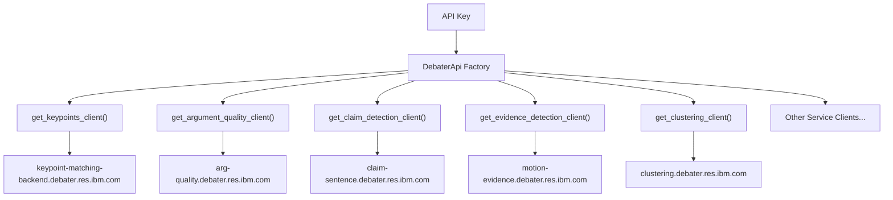

<!-- Source: debater-early-access-program-sdk-Deepwiki.md -->
<!-- Section: Basic Setup and Authentication -->
<!-- Lines: 323-360 -->

## Basic Setup and Authentication

### Creating the API Client

The primary entry point is the `DebaterApi` factory class, which provides access to all available service clients.

```python
from debater_python_api.api.debater_api import DebaterApi

# Initialize with your API key
debater_api = DebaterApi('YOUR_API_KEY_HERE')
```

### Authentication

All API calls require a valid API key. Replace `'YOUR_API_KEY_HERE'` with your actual API key from IBM's Debater Early Access Program.

**Client Architecture Overview**



Sources: [debater_python_api/examples/keypoints_example.py:4-5](), [debater_python_api/integration_tests/api/clients/ServicesIT.py:26]()

