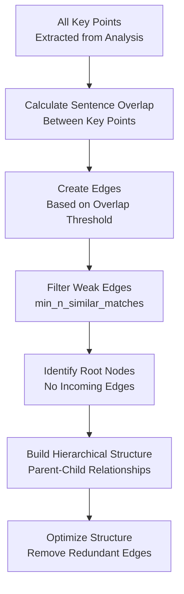

<!-- Source: debater-early-access-program-sdk-Deepwiki.md -->
<!-- Section: Advanced Features -->
<!-- Lines: 724-785 -->

## Advanced Features

### Hierarchical Analysis

The system creates hierarchical relationships between keypoints by analyzing sentence overlap and semantic similarity:

**Edge Calculation:**
- Edges represent relationships between keypoints
- Edge weight = `n_sentences_i_in_j / len(sents_i)`
- Minimum overlap threshold filters weak relationships
- Hierarchical structure keeps only strongest parent relationships

Sources: [debater_python_api/api/clients/key_point_analysis/KpAnalysisUtils.py:191-209](), [debater_python_api/api/clients/key_point_analysis/KpAnalysisUtils.py:247-256]()

### Batch Processing and Caching

The system implements efficient batch processing and caching mechanisms:

**Batch Upload:**
- Comments uploaded in configurable batch sizes (default: 2000)
- Progress tracking for large datasets
- Automatic retry logic for failed uploads

**Caching Strategy:**
- Domain-level caching for incremental analysis
- Delta calculation for new jobs in existing domains
- `use_cache` parameter controls cache behavior

**Comment Processing:**
- Automatic text cleaning and sentence splitting
- Quality score calculation for argument filtering
- Stance analysis when enabled in domain parameters

Sources: [debater_python_api/api/clients/keypoints_client.py:109-143](), [debater_python_api/api/clients/keypoints_client.py:168-211]()17:T3823,# KPA Client Usage

Relevant source files

The following files were used as context for generating this wiki page:

- [debater_python_api/api/clients/keypoints_client.py](debater_python_api/api/clients/keypoints_client.py)
- [debater_python_api/examples/keypoints_example.py](debater_python_api/examples/keypoints_example.py)
- [debater_python_api/integration_tests/api/clients/ServicesIT.py](debater_python_api/integration_tests/api/clients/ServicesIT.py)

This document provides a detailed guide for using the `KpAnalysisClient` to perform Key Point Analysis operations. It covers client initialization, domain management, comment upload, job submission, and result retrieval through the primary client interface.

For information about processing and analyzing KPA results, see [Data Processing and Results](#3.2). For generating reports and visualizations from results, see [Reporting and Visualization](#3.3). For administrative operations and system management, see [Administrative Operations](#3.4).

