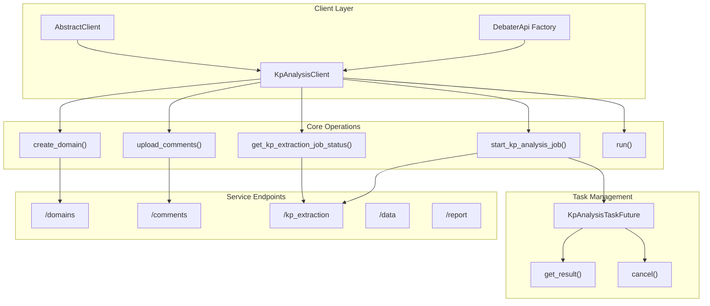

<!-- Source: debater-early-access-program-sdk-Deepwiki.md -->
<!-- Section: KPA Client Architecture -->
<!-- Lines: 812-864 -->

## KPA Client Architecture

Sources: [debater_python_api/api/clients/keypoints_client.py:23-36](), [debater_python_api/api/clients/keypoints_client.py:345-359]()

