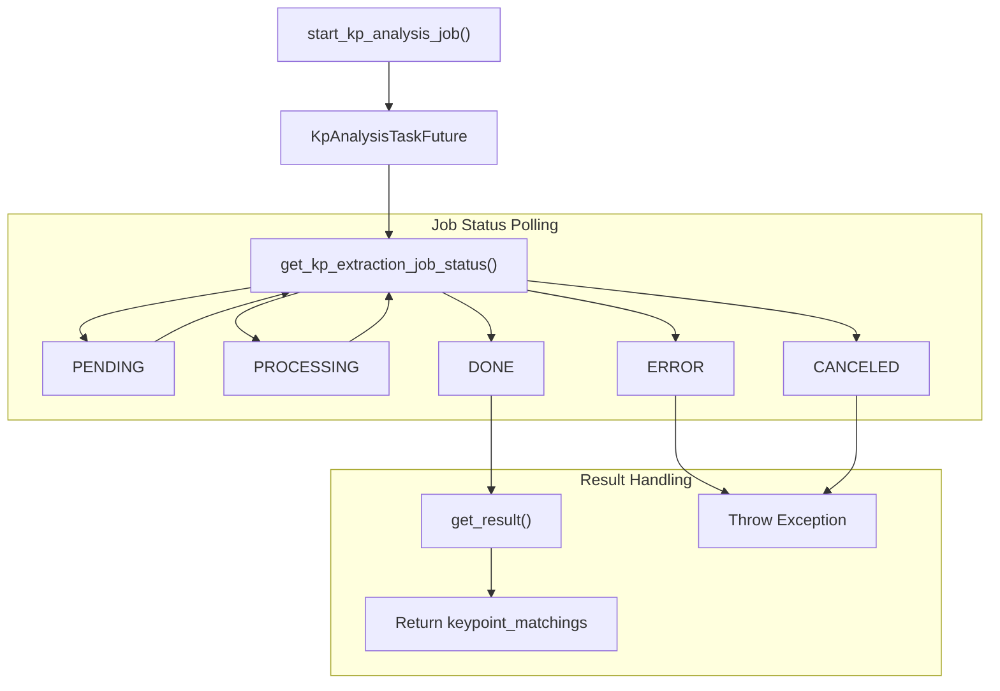

<!-- Source: debater-early-access-program-sdk-Deepwiki.md -->
<!-- Section: Result Retrieval -->
<!-- Lines: 1036-1132 -->

## Result Retrieval

The `KpAnalysisTaskFuture` class provides methods for retrieving job results asynchronously.

### Job Status Flow



### Retrieving Results

```python
# Get result (blocks until completion)
result = future.get_result()

# Get result with limited key points and sentences
result = future.get_result(
    top_k_kps=5,
    top_k_sentences_per_kp=10
)

# Non-blocking check
result = future.get_result(dont_wait=True)
if result is None:
    print("Job still running")

# Get result with timeout
result = future.get_result(wait_secs=300)  # 5 minutes max

# Cancel running job
future.cancel()
```

### Result Structure

The result contains a `keypoint_matchings` list with the following structure:

```python
{
    'keypoint_matchings': [
        {
            'keypoint': 'Cannabis affects memory and cognition',
            'matching': [
                {
                    'domain': 'my_domain',
                    'comment_id': '1',
                    'sentence_id': '1_0',
                    'sentence_text': 'Cannabis has detrimental effects on cognition',
                    'score': 0.95,
                    'argument_quality': 0.87,
                    'num_tokens': 7,
                    'span_start': 0,
                    'span_end': 45
                }
            ]
        }
    ]
}
```

Sources: [debater_python_api/api/clients/keypoints_client.py:367-412](), [debater_python_api/api/clients/keypoints_client.py:213-237]()

