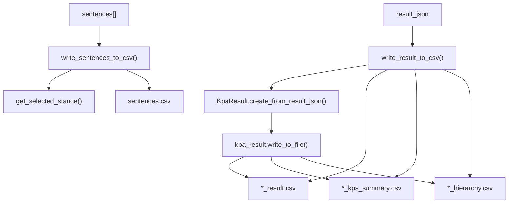

<!-- Source: debater-early-access-program-sdk-Deepwiki.md -->
<!-- Section: CSV File Generation -->
<!-- Lines: 1571-1619 -->

## CSV File Generation

The system generates multiple CSV output formats from KPA results, providing both detailed match data and summary statistics.

### Primary CSV Output

The `write_result_to_csv()` method creates two main CSV files:

```python
KpAnalysisUtils.write_result_to_csv(result_json, result_file, also_hierarchy=True)
```

This generates:
- **Matches file**: Complete sentence-to-key point matching data
- **Summary file**: Aggregated key point statistics with suffix `_kps_summary.csv`
- **Hierarchy file**: Hierarchical relationships when `also_hierarchy=True`

### Sentence Data Export

The `write_sentences_to_csv()` method exports sentence-level data with stance information:

```python
KpAnalysisUtils.write_sentences_to_csv(sentences, out_file)
```

This processes stance dictionaries to determine the highest confidence stance for each sentence and exports the data with stance confidence scores.



**CSV Output Pipeline**

**Sources:** [debater_python_api/api/clients/key_point_analysis/KpAnalysisUtils.py:52-66](), [debater_python_api/api/clients/key_point_analysis/KpAnalysisUtils.py:80-99]()

