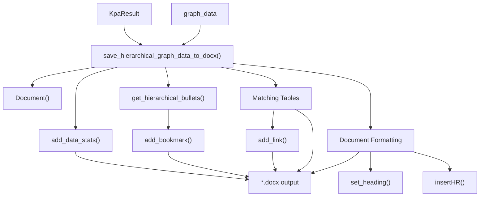

<!-- Source: debater-early-access-program-sdk-Deepwiki.md -->
<!-- Section: DOCX Report Generation -->
<!-- Lines: 1722-1786 -->

## DOCX Report Generation

The system creates comprehensive Microsoft Word documents with formatted reports, navigation, and hierarchical key point displays.

### Document Structure and Formatting

The `save_hierarchical_graph_data_to_docx()` function creates structured DOCX reports:

```python
save_hierarchical_graph_data_to_docx(
    kpa_result=kpa_result,
    graph_data=hierarchical_data,
    result_filename="results.csv",
    n_top_matches=50,
    sort_by_subtree=True,
    include_match_score=False,
    min_n_matches=5,
    file_suff=""
)
```

The generated document includes:
- **Data Statistics**: Overview of comments, sentences, and key points analyzed
- **Key Point Hierarchy**: Navigable hierarchical structure with internal links
- **Matching Sentences**: Detailed tables showing sentences matched to each key point
- **Navigation System**: Bookmarks and hyperlinks for easy document navigation

### Document Components

| Component | Description | Implementation |
|-----------|-------------|----------------|
| Data Statistics | Summary of analysis scope and coverage | `add_data_stats()` |
| Hierarchical Structure | Nested key point organization | `get_hierarchical_bullets()` |
| Matching Tables | Sentence-to-key point mappings | Table generation with `add_table()` |
| Navigation Links | Internal bookmarks and hyperlinks | `add_bookmark()`, `add_link()` |
| Formatting | Consistent styling and layout | Custom paragraph and heading styles |



**DOCX Generation Pipeline**

**Sources:** [debater_python_api/api/clients/key_point_analysis/docx_generator.py:121-297](), [debater_python_api/api/clients/key_point_analysis/docx_generator.py:94-119]()

