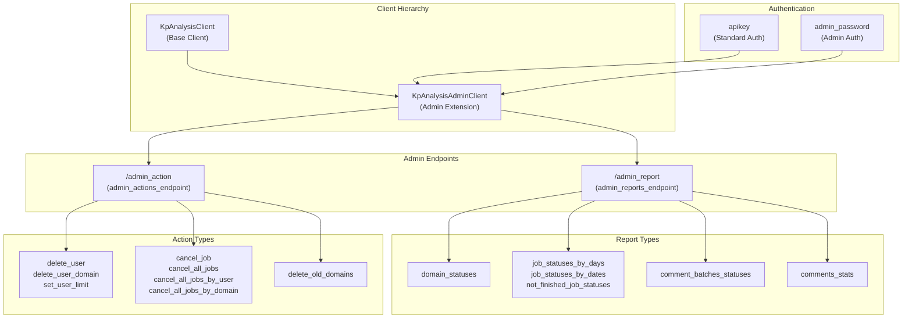

<!-- Source: debater-early-access-program-sdk-Deepwiki.md -->
<!-- Section: Admin Client Overview -->
<!-- Lines: 1823-1877 -->

## Admin Client Overview

The `KpAnalysisAdminClient` provides administrative control over the Key Point Analysis service through two main endpoint categories: reporting and actions. It requires special authentication credentials beyond the standard API key.

### Admin Client Architecture

**Sources:** [debater_python_api/api/clients/keypoints_admin_client.py:1-133]()

