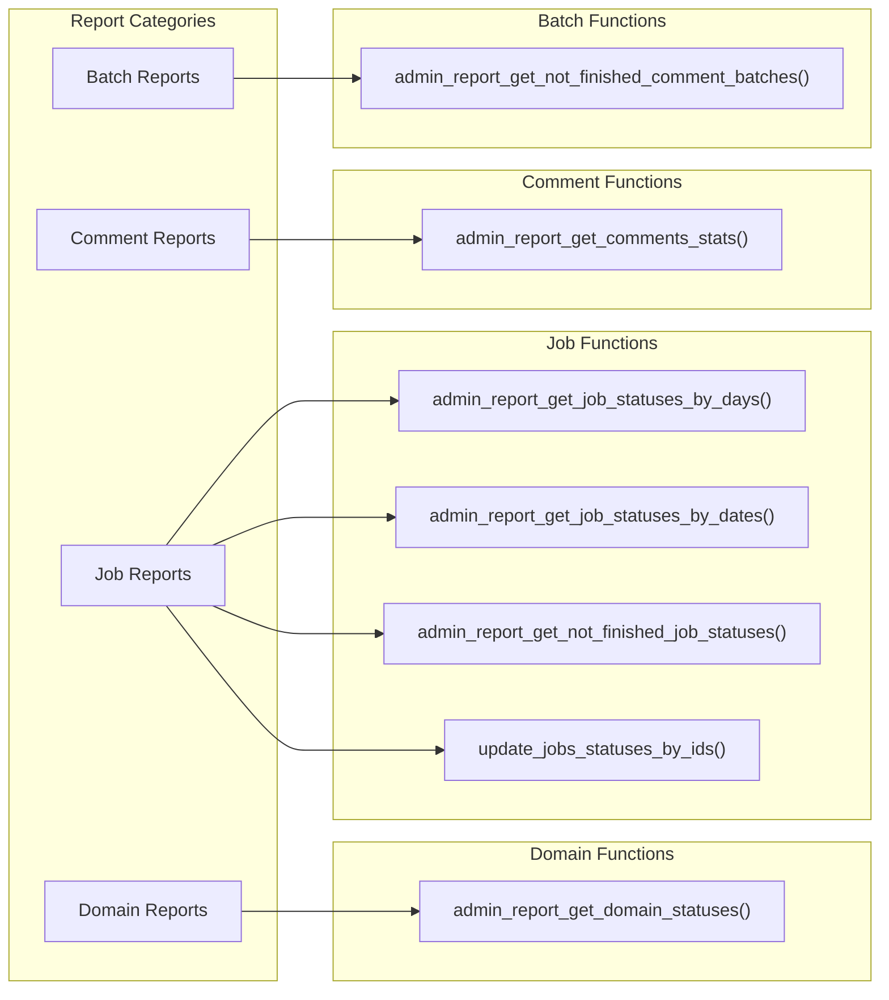

<!-- Source: debater-early-access-program-sdk-Deepwiki.md -->
<!-- Section: Reporting Operations -->
<!-- Lines: 1895-1960 -->

## Reporting Operations

Administrative reporting provides system monitoring and analytics capabilities through the `/admin_report` endpoint.

### Admin Reporting Functions

### Domain Status Reporting

The `admin_report_get_domain_statuses()` function retrieves comprehensive domain status information across all users.

**Sources:** [debater_python_api/api/clients/keypoints_admin_client.py:18-22]()

### Job Status Reporting

| Function | Parameters | Description |
|----------|------------|-------------|
| `admin_report_get_job_statuses_by_days()` | `since_days_ago: int`, `till_days_ago: Optional[int]` | Retrieves job statuses within a day range |
| `admin_report_get_job_statuses_by_dates()` | `since_date: datetime`, `till_date: Optional[datetime]` | Retrieves job statuses within a date range |
| `admin_report_get_not_finished_job_statuses()` | None | Retrieves all incomplete job statuses |
| `update_jobs_statuses_by_ids()` | `job_ids: List[str]` | Updates and retrieves status for specific jobs |

**Sources:** [debater_python_api/api/clients/keypoints_admin_client.py:24-53]()

### Comment and Batch Reporting

The `admin_report_get_comments_stats()` function provides detailed comment statistics with optional filtering by user ID and date range. The `admin_report_get_not_finished_comment_batches()` function monitors incomplete comment batch processing.

**Sources:** [debater_python_api/api/clients/keypoints_admin_client.py:55-74]()

