<!-- Source: debater-early-access-program-sdk-Deepwiki.md -->
<!-- Section: Client Architecture Pattern -->
<!-- Lines: 2059-2113 -->

## Client Architecture Pattern

The following diagram shows how the other NLP service clients fit into the overall SDK architecture:

```mermaid
graph TB
    subgraph "Factory"
        DebaterApi["DebaterApi"]
    end
    
    subgraph "Base Class"
        AbstractClient["AbstractClient<br/>- Authentication<br/>- HTTP Communication<br/>- Batch Processing"]
    end
    
    subgraph "NLP Service Clients"
        ArgumentQualityClient["ArgumentQualityClient"]
        ClaimDetectionClient["ClaimDetectionClient"]
        EvidenceDetectionClient["EvidenceDetectionClient"]
        ClaimBoundariesClient["ClaimBoundariesClient"]
        ClusteringClient["ClusteringClient"]
        ProConClient["ProConClient"]
        NarrativeGenerationClient["NarrativeGenerationClient"]
        TermRelaterClient["TermRelaterClient"]
        TermWikifierClient["TermWikifierClient"]
        ThemeExtractionClient["ThemeExtractionClient"]
        IndexSearcherClient["IndexSearcherClient"]
    end
    
    DebaterApi --> ArgumentQualityClient
    DebaterApi --> ClaimDetectionClient
    DebaterApi --> EvidenceDetectionClient
    DebaterApi --> ClaimBoundariesClient
    DebaterApi --> ClusteringClient
    DebaterApi --> ProConClient
    DebaterApi --> NarrativeGenerationClient
    DebaterApi --> TermRelaterClient
    DebaterApi --> TermWikifierClient
    DebaterApi --> ThemeExtractionClient
    DebaterApi --> IndexSearcherClient
    
    AbstractClient --> ArgumentQualityClient
    AbstractClient --> ClaimDetectionClient
    AbstractClient --> EvidenceDetectionClient
    AbstractClient --> ClaimBoundariesClient
    AbstractClient --> ClusteringClient
    AbstractClient --> ProConClient
    AbstractClient --> NarrativeGenerationClient
    AbstractClient --> TermRelaterClient
    AbstractClient --> TermWikifierClient
    AbstractClient --> ThemeExtractionClient
    AbstractClient --> IndexSearcherClient
```

Sources: [debater_python_api/integration_tests/api/clients/ServicesIT.py:19-27](), [debater_python_api/api/clients/argument_quality_client.py:8-12]()

