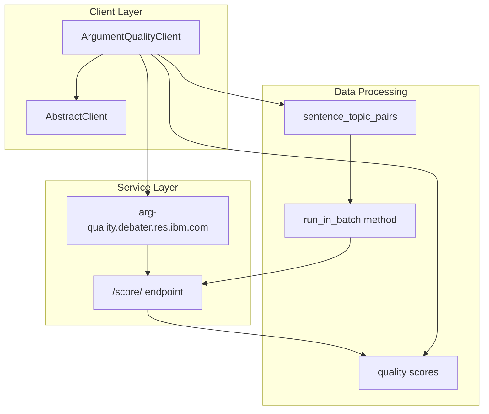

<!-- Source: debater-early-access-program-sdk-Deepwiki.md -->
<!-- Section: Overview -->
<!-- Lines: 2342-2423 -->

## Overview

The `ArgumentQualityClient` is a specialized client that inherits from `AbstractClient` and connects to IBM's argument quality scoring service. It processes batches of sentence-topic pairs and returns quality scores indicating how effectively each sentence argues for or against the given topic.

### Client Architecture

**Sources:** [debater_python_api/api/clients/argument_quality_client.py:1-24]()

### Input Data Format

The client expects input data as a list of dictionaries, each containing:

| Field | Type | Description |
|-------|------|-------------|
| `sentence` | string | The argument sentence to evaluate |
| `topic` | string | The topic context for scoring |

### Core Functionality

```mermaid
graph LR
    subgraph "Input Processing"
        InputValidation["validate inputs"]
        PairFormatting["format sentence-topic pairs"]
    end
    
    subgraph "Batch Processing"
        RunInBatch["run_in_batch method"]
        BatchRequest["HTTP batch request"]
    end
    
    subgraph "Service Communication"
        ArgQualityEndpoint["arg-quality.debater.res.ibm.com/score/"]
        ScoreCalculation["argument quality scoring"]
    end
    
    subgraph "Response Handling"
        ScoreResults["quality scores"]
        TimestampLogging["execution time logging"]
    end
    
    InputValidation --> PairFormatting
    PairFormatting --> RunInBatch
    RunInBatch --> BatchRequest
    BatchRequest --> ArgQualityEndpoint
    ArgQualityEndpoint --> ScoreCalculation
    ScoreCalculation --> ScoreResults
    ScoreResults --> TimestampLogging
```

**Sources:** [debater_python_api/api/clients/argument_quality_client.py:13-23]()

