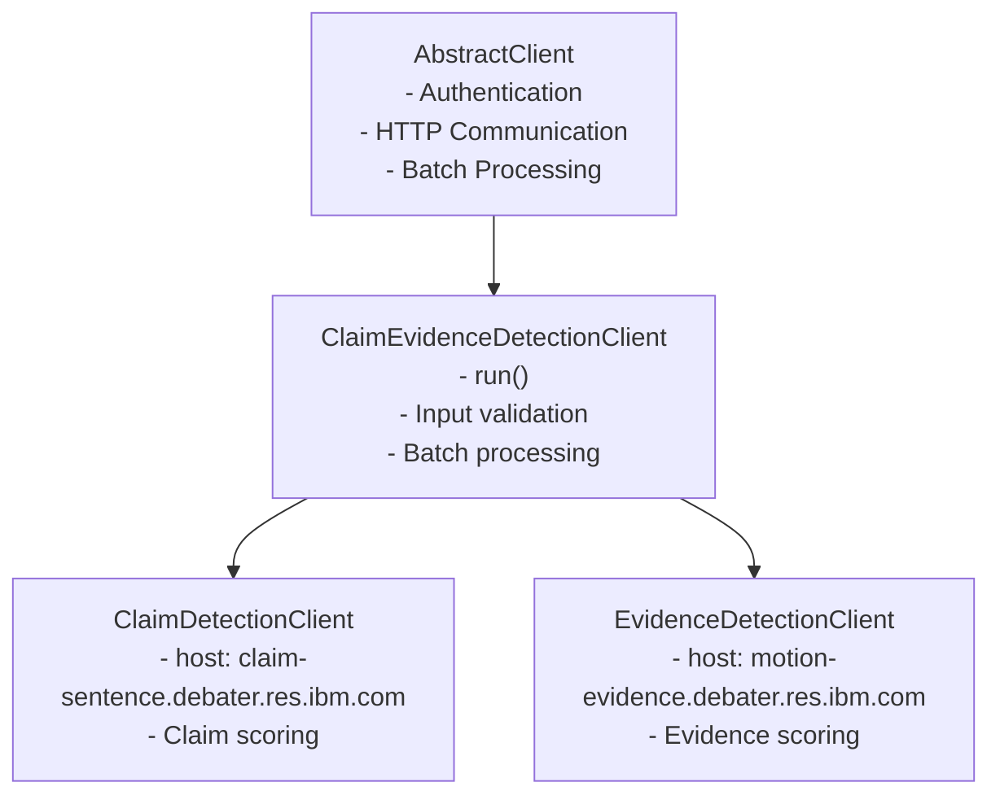
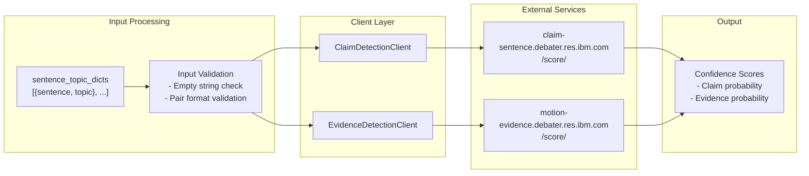

<!-- Source: debater-early-access-program-sdk-Deepwiki.md -->
<!-- Section: Architecture Overview -->
<!-- Lines: 2549-2609 -->

## Architecture Overview

The Claim and Evidence Detection system follows the standard client architecture pattern used throughout the SDK. Both detection clients inherit from a shared base class that provides common functionality for processing sentence-topic pairs.

### Client Class Hierarchy

**Sources:** [debater_python_api/api/clients/claim_and_evidence_detection_client.py:1-37]()

### Service Integration

The clients communicate with IBM Debater services through REST APIs, processing sentence-topic pairs and returning confidence scores.

**Sources:** [debater_python_api/api/clients/claim_and_evidence_detection_client.py:13-24](), [debater_python_api/api/clients/claim_and_evidence_detection_client.py:26-36]()

