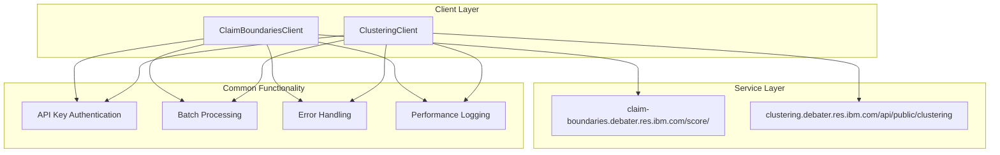

<!-- Source: debater-early-access-program-sdk-Deepwiki.md -->
<!-- Section: Service Integration -->
<!-- Lines: 2898-2954 -->

## Service Integration

Both clients integrate with their respective IBM Debater services using the standard `AbstractClient` pattern:

Both clients inherit common functionality from `AbstractClient` including authentication, batch processing capabilities, and standardized error handling patterns.

**Sources:** [debater_python_api/api/clients/claim_boundaries_client.py:5-13](), [debater_python_api/api/clients/clustering_client.py:5-12]()1f:T2e82,# Development Guide

Relevant source files

The following files were used as context for generating this wiki page:

- [debater_python_api/api/clients/abstract_client.py](debater_python_api/api/clients/abstract_client.py)
- [debater_python_api/api/clients/key_point_analysis/KpaExceptions.py](debater_python_api/api/clients/key_point_analysis/KpaExceptions.py)

This document provides technical information for developers working with or extending the Debater Early Access Program SDK. It covers the internal architecture, error handling patterns, development utilities, and best practices for extending the SDK functionality.

The Development Guide focuses on implementation details and code organization. For basic usage and API documentation, see [Getting Started](#2) and [Key Point Analysis](#3). For detailed API reference, see [Reference](#6).

