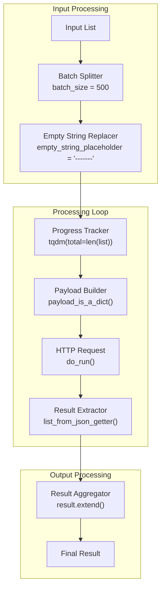

<!-- Source: debater-early-access-program-sdk-Deepwiki.md -->
<!-- Section: Abstract Client Base Class -->
<!-- Lines: 3353-3400 -->

## Abstract Client Base Class

The `AbstractClient` class provides common functionality for all service clients, including HTTP communication, batch processing, error handling, and retry logic.

### Core Functionality

| Component | Purpose | Key Methods |
|-----------|---------|-------------|
| Authentication | API key validation and header management | `validate_api_key_or_throw_exception()`, `get_default_request_header()` |
| HTTP Communication | Request handling and response processing | `do_run()`, `get_status_error_msg()` |
| Batch Processing | Large dataset processing with progress tracking | `run_in_batch()`, `payload_is_a_dict()` |
| Error Handling | Retry logic and connection error management | `do_run()` with retry parameter |
| Progress Tracking | Visual progress indicators | `tqdm` integration in `run_in_batch()` |

### Batch Processing Architecture

**Sources:** [debater_python_api/api/clients/abstract_client.py:15-16](), [debater_python_api/api/clients/abstract_client.py:37-53](), [debater_python_api/api/clients/abstract_client.py:32-35](), [debater_python_api/api/clients/abstract_client.py:40-42]()

