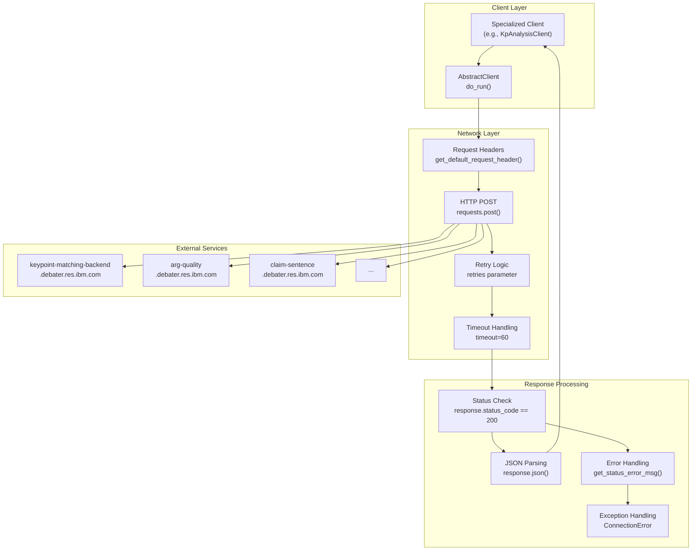

<!-- Source: debater-early-access-program-sdk-Deepwiki.md -->
<!-- Section: Service Communication Layer -->
<!-- Lines: 3401-3453 -->

## Service Communication Layer

The SDK manages communication with multiple IBM Debater service endpoints through a consistent HTTP-based architecture.

### Request/Response Flow

**Sources:** [debater_python_api/api/clients/abstract_client.py:58-89](), [debater_python_api/api/clients/abstract_client.py:90-106](), [debater_python_api/utils/general_utils.py:12-13]()

