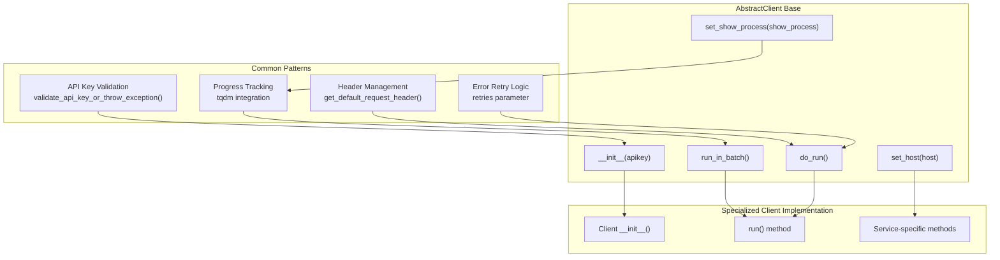

<!-- Source: debater-early-access-program-sdk-Deepwiki.md -->
<!-- Section: Client Inheritance Pattern -->
<!-- Lines: 3454-3513 -->

## Client Inheritance Pattern

All specialized clients inherit from `AbstractClient` and implement service-specific functionality while maintaining consistent behavior patterns.

### Specialized Client Types

| Client Class | Service Endpoint Pattern | Primary Function |
|-------------|--------------------------|------------------|
| `KpAnalysisClient` | `keypoint-matching-backend.debater.res.ibm.com` | Key point analysis and matching |
| `ArgumentQualityClient` | `arg-quality.debater.res.ibm.com` | Argument quality scoring |
| `ClaimDetectionClient` | `claim-sentence.debater.res.ibm.com` | Claim detection in text |
| `EvidenceDetectionClient` | `motion-evidence.debater.res.ibm.com` | Evidence detection |
| `ClusteringClient` | `clustering.debater.res.ibm.com` | Sentence clustering |
| `ClaimBoundariesClient` | `claim-boundaries.debater.res.ibm.com` | Claim boundary detection |
| `ProConClient` | Service-specific endpoint | Pro/con stance detection |
| `NarrativeGenerationClient` | Service-specific endpoint | Narrative generation |
| `TermRelaterClient` | Service-specific endpoint | Term relationship scoring |
| `TermWikifierClient` | Service-specific endpoint | Term wikification |
| `ThemeExtractionClient` | Service-specific endpoint | Theme extraction from clusters |
| `IndexSearcherClient` | Service-specific endpoint | Sentence index searching |

### Common Client Interface

**Sources:** [debater_python_api/api/clients/abstract_client.py:19-31](), [debater_python_api/api/clients/abstract_client.py:26-30](), [debater_python_api/integration_tests/api/clients/ServicesIT.py:28-44](), [debater_python_api/integration_tests/api/clients/ServicesIT.py:45-61]()

