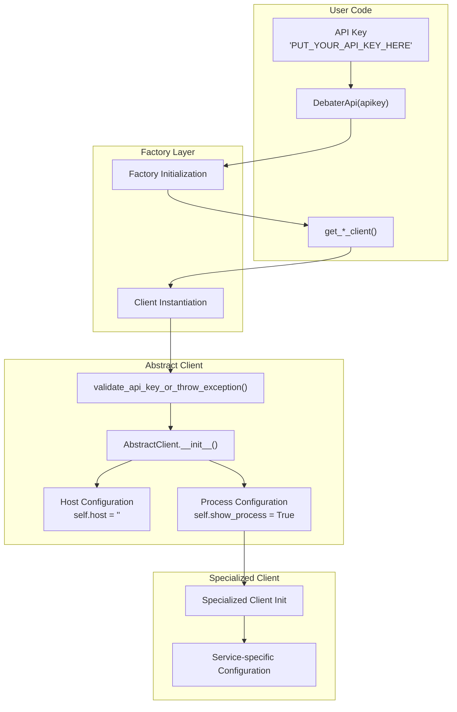

<!-- Source: debater-early-access-program-sdk-Deepwiki.md -->
<!-- Section: Configuration and Initialization -->
<!-- Lines: 3514-3558 -->

## Configuration and Initialization

The SDK uses a consistent initialization pattern across all components, with API key validation as the primary security mechanism.

### Initialization Flow

**Sources:** [debater_python_api/api/clients/abstract_client.py:20-25](), [debater_python_api/examples/keypoints_example.py:4](), [debater_python_api/integration_tests/api/clients/ServicesIT.py:26](), [debater_python_api/utils/general_utils.py:12]()

