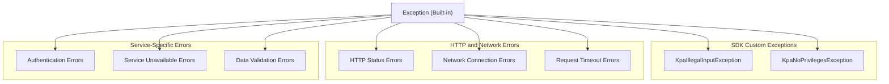

<!-- Source: debater-early-access-program-sdk-Deepwiki.md -->
<!-- Section: Exception Types and Hierarchy -->
<!-- Lines: 3590-3639 -->

## Exception Types and Hierarchy

The SDK defines custom exceptions to provide meaningful error information for different failure scenarios. The exception hierarchy is designed to allow applications to handle errors at appropriate levels of granularity.

### Key Point Analysis Exceptions

The Key Point Analysis system defines specific exceptions for domain-related operations:

| Exception Type | Purpose | Usage Context |
|---|---|---|
| `KpaIllegalInputException` | Invalid input parameters or data format | Data validation, parameter checking |
| `KpaNoPrivilegesException` | Insufficient permissions for admin operations | Administrative functions, user access control |

Sources: [debater_python_api/api/clients/key_point_analysis/KpaExceptions.py:2-12]()

### Exception Hierarchy Structure

Sources: [debater_python_api/api/clients/key_point_analysis/KpaExceptions.py:2-12]()

