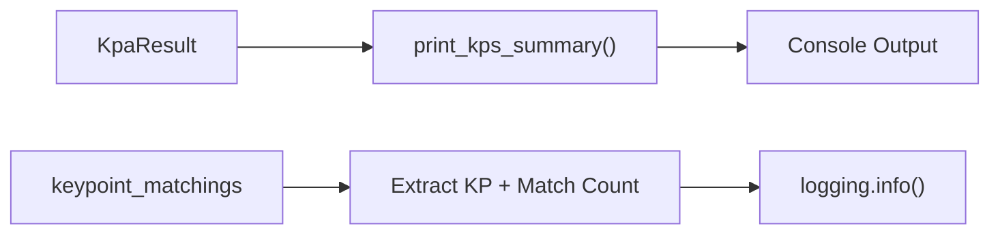
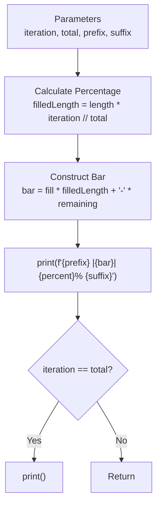

<!-- Source: debater-early-access-program-sdk-Deepwiki.md -->
<!-- Section: Display and Output Utilities -->
<!-- Lines: 3863-3912 -->

## Display and Output Utilities

### KPA Results Display

The `print_kps_summary()` function provides formatted output of key point analysis results:

**Key Point Summary Display Process**

The function processes `keypoint_matchings` data to extract key points and their associated argument counts, outputting formatted summaries to the console via logging.

*Sources: [debater_python_api/utils/kp_analysis_utils.py:6-11]()*

### Progress Tracking

The `print_progress_bar()` function creates terminal progress indicators:

**Progress Bar Generation Process**

*Sources: [debater_python_api/utils/kp_analysis_utils.py:27-46]()*

### Status Reporting

The `print_report()` function displays domain and job status information:

| Report Section | Data Source | Output Format |
|---|---|---|
| Comments Status | `report['comments_status']` | Domain-status pairs |
| KP Analysis Jobs | `report['kp_analysis_status']` | Job status objects |

*Sources: [debater_python_api/utils/kp_analysis_utils.py:14-24]()*

