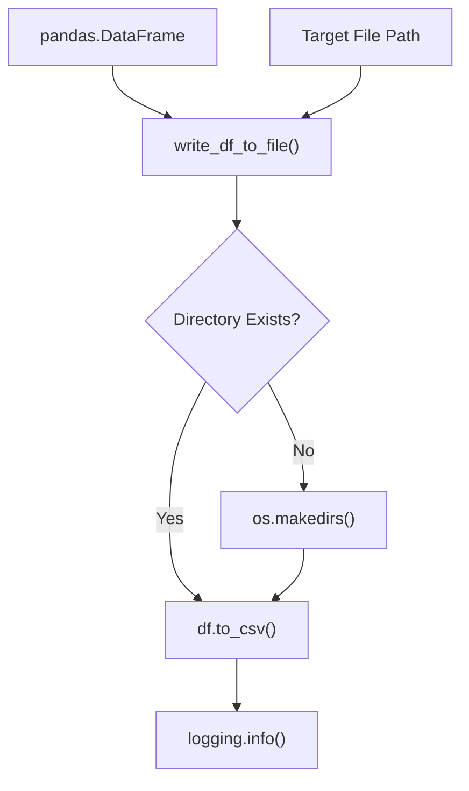

<!-- Source: debater-early-access-program-sdk-Deepwiki.md -->
<!-- Section: File System Utilities -->
<!-- Lines: 3975-4014 -->

## File System Utilities

### Directory Operations

The `get_all_files_in_dir()` function retrieves all files from a directory:

**Directory File Listing Process**

*Sources: [debater_python_api/api/clients/key_point_analysis/utils.py:53-56]()*

### File Writing Operations

The `write_df_to_file()` function handles DataFrame persistence:

**DataFrame File Writing Process**

The function ensures target directories exist before writing CSV files, creating them if necessary.

*Sources: [debater_python_api/api/clients/key_point_analysis/utils.py:58-64]()*

