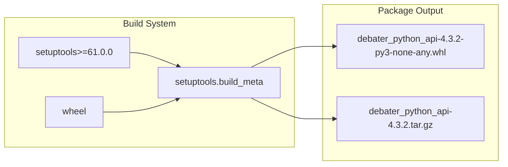

<!-- Source: debater-early-access-program-sdk-Deepwiki.md -->
<!-- Section: Project Configuration -->
<!-- Lines: 4044-4085 -->

## Project Configuration

The SDK is configured as a Python package using modern `pyproject.toml` standards. The project metadata defines the package identity, version, and basic distribution information.

### Package Identity

| Property | Value |
|----------|-------|
| Package Name | `debater_python_api` |
| Version | `4.3.2` |
| Description | Project Debater Early Access Program API sdk for python |
| Author | Elad Venezian (eladv@il.ibm.com) |
| License | File-based (LICENSE) |
| Python Requirement | >= 3.6 |

### Build System Configuration

The project uses the standard `setuptools` build backend with wheel support:

**Build System Dependency Flow**

Sources: [pyproject.toml:3-5]()

