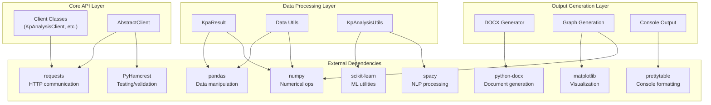

<!-- Source: debater-early-access-program-sdk-Deepwiki.md -->
<!-- Section: Dependencies and Requirements -->
<!-- Lines: 4086-4157 -->

## Dependencies and Requirements

The SDK has a comprehensive set of dependencies that support its various NLP capabilities, data processing, and reporting features.

### Core Dependencies

| Package | Purpose | Used By |
|---------|---------|---------|
| `requests` | HTTP client for API communication | All client classes |
| `prettytable` | Console table formatting | Result display utilities |
| `scikit-learn` | Machine learning utilities | Data analysis features |
| `matplotlib` | Plotting and visualization | Graph generation |
| `numpy` | Numerical computing | Data processing |
| `pandas` | Data manipulation | CSV/DataFrame operations |
| `spacy` | NLP processing | Text analysis features |
| `PyHamcrest` | Assertion library | Testing and validation |
| `python-docx` | DOCX document generation | Report generation |

### Dependency Architecture

**SDK Dependency Relationships**

Sources: [pyproject.toml:18-28]()

