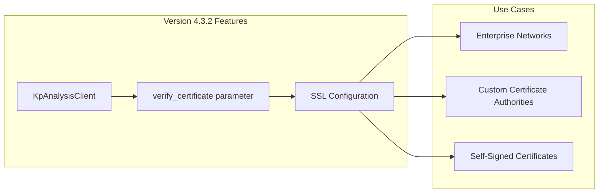
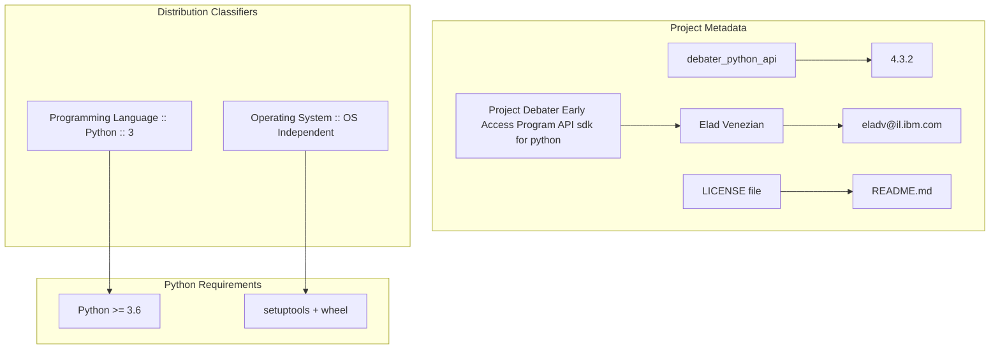

<!-- Source: debater-early-access-program-sdk-Deepwiki.md -->
<!-- Section: Release Information -->
<!-- Lines: 4158-4233 -->

## Release Information

### Current Version: 4.3.2

The current release introduces SSL certificate verification control for enhanced security configuration in enterprise environments.

#### Key Changes in 4.3.2

- **Certificate Verification Control**: Added `verify_certificate` parameter to `KpAnalysisClient` 
- **Enterprise Support**: Enables SDK usage in environments with custom certificate authorities or self-signed certificates
- **Backward Compatibility**: Parameter defaults to `True` maintaining existing security behavior

**Certificate Verification Feature Architecture**

Sources: [pyproject.toml:9](), [Release:1]()

### Project Metadata

The project follows Python packaging best practices with comprehensive metadata:

**Project Metadata Structure**

Sources: [pyproject.toml:7-17](), [pyproject.toml:29]()

