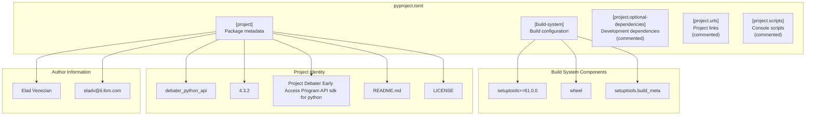

<!-- Source: debater-early-access-program-sdk-Deepwiki.md -->
<!-- Section: Project Metadata -->
<!-- Lines: 4272-4332 -->

## Project Metadata

The SDK is configured as a Python package named `debater_python_api` with comprehensive metadata defined in the project configuration. The package follows modern Python packaging standards using the `pyproject.toml` configuration format.

**Project Configuration Structure**

The core project metadata includes:

| Configuration | Value | Description |
|---------------|-------|-------------|
| Package Name | `debater_python_api` | Python package identifier |
| Version | `4.3.2` | Current release version |
| Description | Project Debater Early Access Program API sdk for python | Package summary |
| Author | Elad Venezian (eladv@il.ibm.com) | Package maintainer |
| License | File-based (LICENSE) | License reference |
| README | README.md | Package documentation |

Sources: [pyproject.toml:7-17]()

