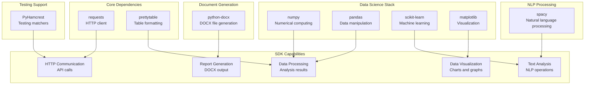

<!-- Source: debater-early-access-program-sdk-Deepwiki.md -->
<!-- Section: Dependencies -->
<!-- Lines: 4368-4436 -->

## Dependencies

The SDK has a comprehensive set of runtime dependencies covering HTTP communication, data processing, machine learning, visualization, and document generation capabilities.

**Dependency Categories and Relationships**

### Runtime Dependencies

The following table details the purpose of each runtime dependency:

| Dependency | Purpose | Usage Context |
|------------|---------|---------------|
| `requests` | HTTP client library | API communication with Debater services |
| `prettytable` | ASCII table formatting | Console output formatting |
| `scikit-learn` | Machine learning utilities | Data processing and analysis |
| `matplotlib` | Plotting and visualization | Graph generation and data visualization |
| `numpy` | Numerical computing | Mathematical operations and array processing |
| `pandas` | Data manipulation | DataFrame operations and CSV/JSON processing |
| `spacy` | Natural language processing | Text analysis and linguistic processing |
| `PyHamcrest` | Testing and matching | Assertion utilities for API responses |
| `python-docx` | DOCX document generation | Report generation and document creation |

Sources: [pyproject.toml:18-28]()

