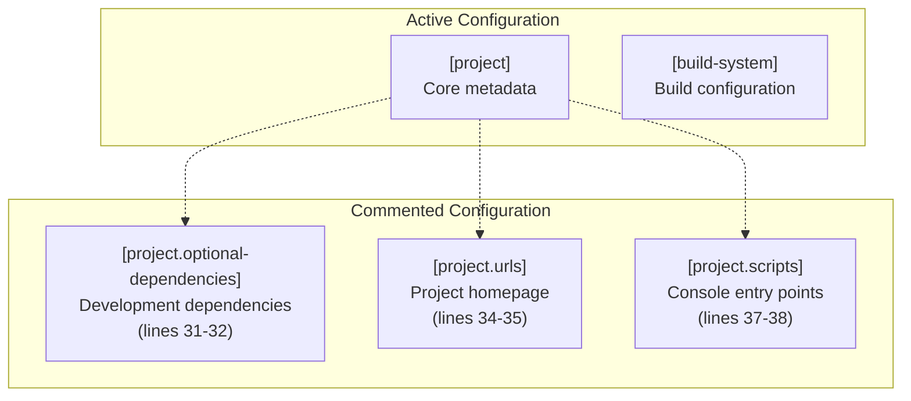

<!-- Source: debater-early-access-program-sdk-Deepwiki.md -->
<!-- Section: Optional Configuration -->
<!-- Lines: 4473-4513 -->

## Optional Configuration

The project configuration includes commented sections for optional development features that are not currently active but provide templates for future enhancements.

**Optional Configuration Structure**

### Commented Sections

The following optional configurations are available but currently commented out:

| Section | Purpose | Example Content |
|---------|---------|-----------------|
| `[project.optional-dependencies]` | Development dependencies | `dev = ["black", "bumpver", "isort", "pip-tools", "pytest"]` |
| `[project.urls]` | Project homepage and links | `Homepage = "https://github.com/realpython/reader"` |
| `[project.scripts]` | Console script entry points | `realpython = "reader.__main__:main"` |

These sections can be uncommented and configured to:
- Add development dependencies for code formatting and testing
- Specify project URLs for package metadata
- Create console commands for SDK utilities

Sources: [pyproject.toml:31-38]()

