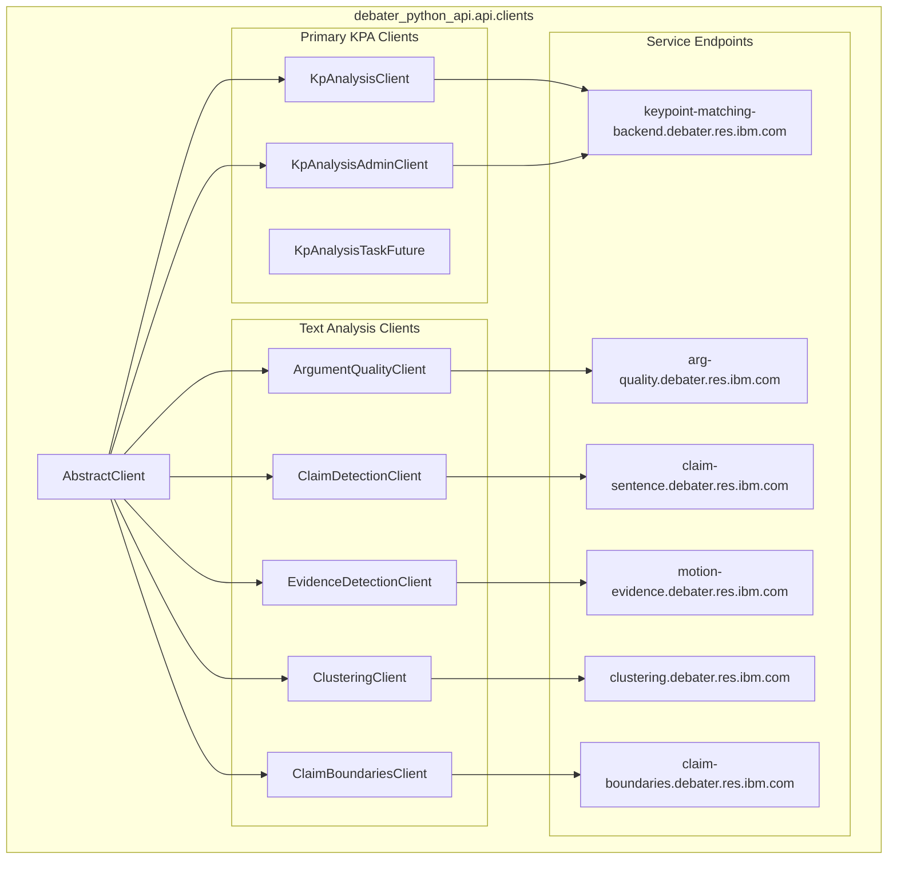

<!-- Source: debater-early-access-program-sdk-Deepwiki.md -->
<!-- Section: Client Package Organization -->
<!-- Lines: 4610-4661 -->

## Client Package Organization

**Client Inheritance and Service Mapping**: This diagram illustrates how all service clients inherit from `AbstractClient` and map to specific IBM Debater service endpoints.

*Sources: [debater_python_api/api/clients/__init__.py:1-1]()*

