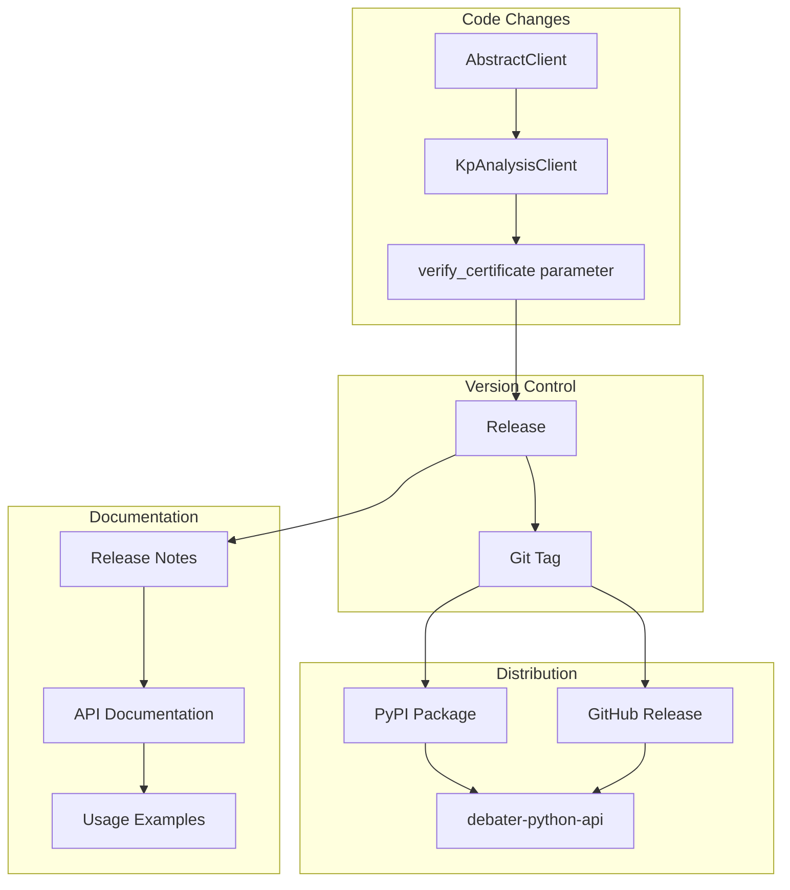
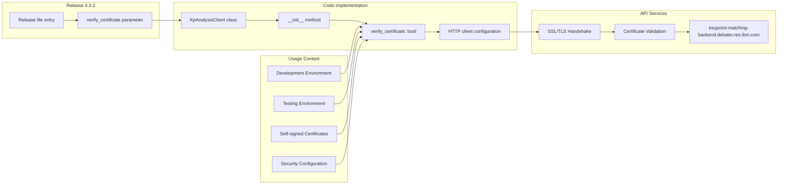

<!-- Source: debater-early-access-program-sdk-Deepwiki.md -->
<!-- Section: Release Notes -->
<!-- Lines: 4760-4877 -->

## Release Notes

The SDK follows semantic versioning with release notes documenting feature additions, bug fixes, and breaking changes. Each release is tracked with specific version numbers and detailed change descriptions.

### Version History

The following table summarizes the documented releases:

| Version | Type | Description | Component |
|---------|------|-------------|-----------|
| 4.3.2 | Feature | Added certificate verification control | `KpAnalysisClient` |

### Version 4.3.2

This release introduced enhanced security configuration options for the Key Point Analysis client.

**Features Added:**
- **Certificate Verification Control**: Added `verify_certificate` parameter to `KpAnalysisClient` constructor
- **SSL/TLS Flexibility**: Allows disabling certificate verification for development and testing environments
- **Backward Compatibility**: Default behavior remains unchanged (verification enabled)

**Implementation Details:**
- Parameter added to `KpAnalysisClient.__init__()` method
- Controls underlying HTTP client SSL verification settings
- Useful for connecting to development servers with self-signed certificates

### Release Process Flow

**Sources:** [Release:1]()

### Feature Implementation Mapping

**Sources:** [Release:1]()

