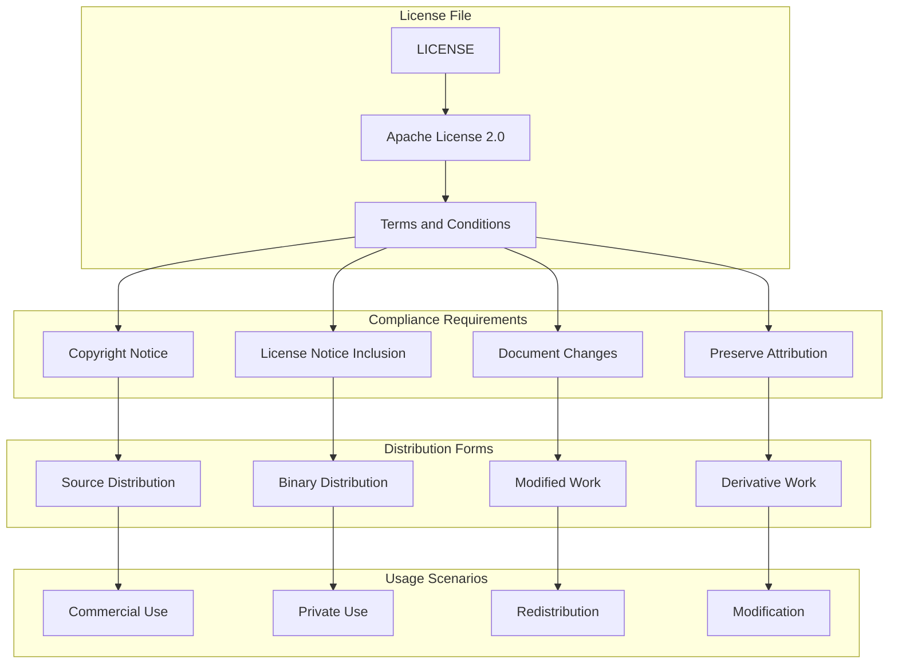
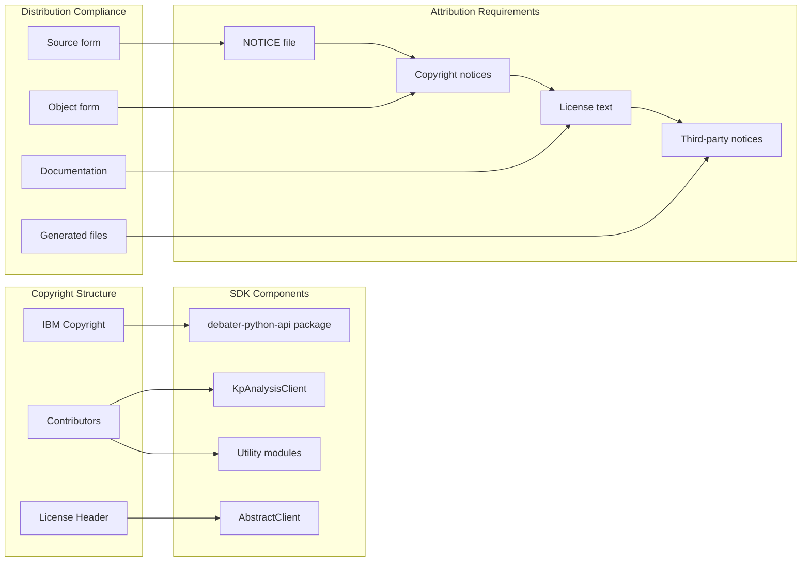

<!-- Source: debater-early-access-program-sdk-Deepwiki.md -->
<!-- Section: License Information -->
<!-- Lines: 4878-5024 -->

## License Information

The Debater Early Access Program SDK is distributed under the Apache License Version 2.0. This license provides broad permissions for use, modification, and distribution while maintaining appropriate attribution requirements.

### License Summary

| Aspect | Details |
|--------|---------|
| License Type | Apache License 2.0 |
| Copyright | IBM |
| Permissions | Use, modify, distribute, sublicense |
| Requirements | License notice, state changes |
| Limitations | No warranty, no liability |

### Key License Terms

**Permissions:**
- Commercial and private use
- Modification and distribution
- Sublicensing
- Patent grant from contributors

**Requirements:**
- Include license and copyright notice
- State significant changes made to files
- Preserve attribution notices in redistributions

**Limitations:**
- No trademark rights granted
- No warranty provided
- Limited liability protection

### License Compliance Structure

**Sources:** [LICENSE:1-203]()

### Copyright and Attribution

**Sources:** [LICENSE:1-203]()

### Complete License Text

The complete Apache License Version 2.0 text is included in the repository root as the `LICENSE` file. The license includes the following key sections:

1. **Definitions** - Clarifies terms used throughout the license
2. **Grant of Copyright License** - Provides broad usage rights
3. **Grant of Patent License** - Includes patent protection for users
4. **Redistribution Requirements** - Specifies attribution and notice requirements
5. **Contribution Terms** - Defines how contributions are licensed
6. **Trademark Limitations** - Clarifies trademark usage restrictions
7. **Warranty Disclaimer** - Excludes warranties and guarantees
8. **Liability Limitations** - Limits contributor liability
9. **Additional Terms** - Allows additional warranty or liability terms

**Sources:** [LICENSE:1-203]()

