<!-- Source: debater-early-access-program-sdk-Deepwiki.md -->
<!-- Section: Overall SDK Architecture -->
<!-- Lines: 27-107 -->

## Overall SDK Architecture

The SDK follows a layered architecture pattern with clear separation between client interfaces, data processing, and service communication:

### SDK Architecture Overview

```mermaid
graph TB
    subgraph "Client_Factory_Layer"
        DebaterApi["DebaterApi"]
    end
    
    subgraph "Abstract_Base_Layer"
        AbstractClient["AbstractClient"]
    end
    
    subgraph "Specialized_Clients"
        KpAnalysisClient["KpAnalysisClient"]
        KpAnalysisAdminClient["KpAnalysisAdminClient"]
        ArgumentQualityClient["ArgumentQualityClient"]
        ClaimDetectionClient["ClaimDetectionClient"]
        EvidenceDetectionClient["EvidenceDetectionClient"]
        ClusteringClient["ClusteringClient"]
        ClaimBoundariesClient["ClaimBoundariesClient"]
    end
    
    subgraph "Data_Processing_Layer"
        KpaResult["KpaResult"]
        KpAnalysisUtils["KpAnalysisUtils"]
        DataUtils["Data Utils"]
    end
    
    subgraph "Output_Generation"
        DocxGenerator["DOCX Generator"]
        CsvExporter["CSV Exporter"]
        JsonExporter["JSON Exporter"]
    end
    
    subgraph "External_Services"
        KpaService["keypoint-matching-backend.debater.res.ibm.com"]
        ArgQualityService["arg-quality.debater.res.ibm.com"]
        ClaimDetectionService["claim-sentence.debater.res.ibm.com"]
        EvidenceService["motion-evidence.debater.res.ibm.com"]
        ClusteringService["clustering.debater.res.ibm.com"]
        BoundariesService["claim-boundaries.debater.res.ibm.com"]
    end
    
    DebaterApi --> KpAnalysisClient
    DebaterApi --> ArgumentQualityClient
    DebaterApi --> ClaimDetectionClient
    DebaterApi --> EvidenceDetectionClient
    DebaterApi --> ClusteringClient
    DebaterApi --> ClaimBoundariesClient
    
    AbstractClient --> KpAnalysisClient
    AbstractClient --> KpAnalysisAdminClient
    AbstractClient --> ArgumentQualityClient
    AbstractClient --> ClaimDetectionClient
    AbstractClient --> EvidenceDetectionClient
    AbstractClient --> ClusteringClient
    AbstractClient --> ClaimBoundariesClient
    
    KpAnalysisClient --> KpaResult
    KpAnalysisClient --> KpaService
    KpAnalysisAdminClient --> KpaService
    ArgumentQualityClient --> ArgQualityService
    ClaimDetectionClient --> ClaimDetectionService
    EvidenceDetectionClient --> EvidenceService
    ClusteringClient --> ClusteringService
    ClaimBoundariesClient --> BoundariesService
    
    KpaResult --> KpAnalysisUtils
    KpAnalysisUtils --> DocxGenerator
    KpAnalysisUtils --> CsvExporter
    KpAnalysisUtils --> JsonExporter
    KpAnalysisUtils --> DataUtils
```

This architecture provides a consistent interface across all Debater services while allowing specialized functionality for each service type. The `DebaterApi` factory class serves as the primary entry point, while `AbstractClient` provides common functionality like authentication, HTTP communication, and error handling.

Sources: Based on architectural patterns described in context diagrams

