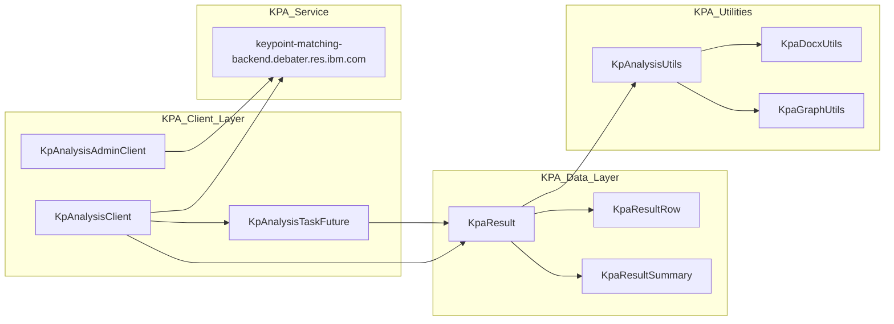

<!-- Source: debater-early-access-program-sdk-Deepwiki.md -->
<!-- Section: Key Components -->
<!-- Lines: 108-176 -->

## Key Components

### Core Client Infrastructure

| Component | Purpose | Key Classes |
|-----------|---------|-------------|
| Factory Pattern | Single entry point for all clients | `DebaterApi` |
| Base Client | Common functionality across all services | `AbstractClient` |
| Authentication | API key management and request signing | Built into `AbstractClient` |
| HTTP Communication | Request/response handling with retry logic | Built into `AbstractClient` |

### Primary Feature: Key Point Analysis

The Key Point Analysis system is the SDK's most comprehensive feature, providing:

The KPA system supports domain management, comment upload, asynchronous job processing, and comprehensive result analysis with multiple output formats.

Sources: Based on KPA system architecture from context diagrams

### Additional NLP Services

The SDK provides specialized clients for various NLP tasks:

| Service | Client Class | Endpoint | Purpose |
|---------|-------------|----------|---------|
| Argument Quality | `ArgumentQualityClient` | `arg-quality.debater.res.ibm.com` | Score argument quality |
| Claim Detection | `ClaimDetectionClient` | `claim-sentence.debater.res.ibm.com` | Identify claims in text |
| Evidence Detection | `EvidenceDetectionClient` | `motion-evidence.debater.res.ibm.com` | Detect supporting evidence |
| Text Clustering | `ClusteringClient` | `clustering.debater.res.ibm.com` | Cluster similar sentences |
| Claim Boundaries | `ClaimBoundariesClient` | `claim-boundaries.debater.res.ibm.com` | Identify claim boundaries |

