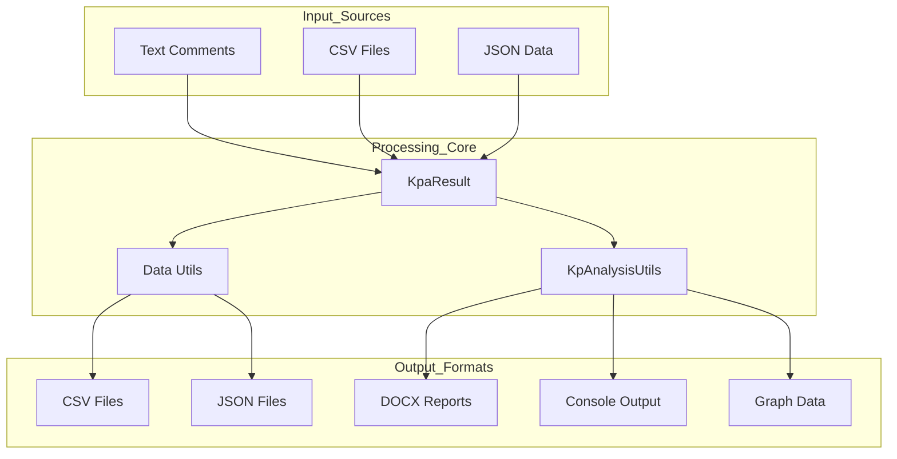

<!-- Source: debater-early-access-program-sdk-Deepwiki.md -->
<!-- Section: Data Processing and Output Pipeline -->
<!-- Lines: 177-221 -->

## Data Processing and Output Pipeline

The SDK provides comprehensive data processing capabilities with multiple output formats:

### Data Flow Architecture

The data processing pipeline supports transformation between formats, statistical analysis, hierarchical data organization, and report generation.

Sources: Based on data processing architecture from context diagrams

