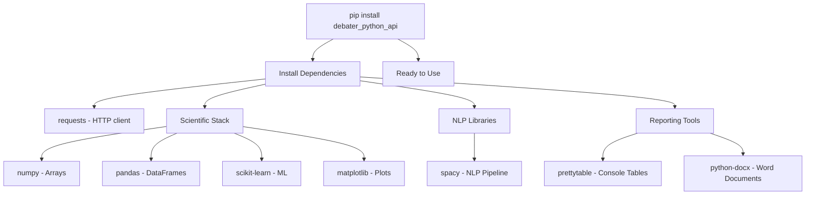

<!-- Source: debater-early-access-program-sdk-Deepwiki.md -->
<!-- Section: Installation -->
<!-- Lines: 277-322 -->

## Installation

### Requirements

The SDK requires Python 3.6 or higher and depends on several scientific computing libraries for data processing and analysis.

| Component | Version Requirement |
|-----------|-------------------|
| Python | >= 3.6 |
| Core Dependencies | requests, prettytable, scikit-learn, matplotlib, numpy, pandas, spacy, PyHamcrest, python-docx |

### Installing the Package

Install the SDK using pip:

```bash
pip install debater_python_api
```

The package will automatically install all required dependencies including scientific computing libraries for data analysis and visualization.

**Installation Flow Diagram**



Sources: [pyproject.toml:18-28]()

