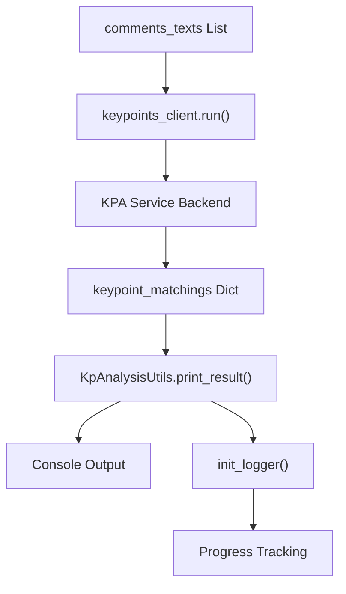

<!-- Source: debater-early-access-program-sdk-Deepwiki.md -->
<!-- Section: Quick Start Example -->
<!-- Lines: 361-414 -->

## Quick Start Example

### Key Point Analysis (Primary Feature)

The most commonly used feature is Key Point Analysis, which identifies and matches key points in collections of text comments.

```python
from debater_python_api.api.clients.key_point_analysis.KpAnalysisUtils import KpAnalysisUtils
from debater_python_api.api.debater_api import DebaterApi

# Initialize API client
debater_api = DebaterApi('YOUR_API_KEY_HERE')
keypoints_client = debater_api.get_keypoints_client()

# Sample comments about cannabis
comments_texts = [
    'Cannabis has detrimental effects on cognition and memory, some of which are irreversible.',
    'Cannabis can severely impact memory and productivity in its consumers.',
    'Cannabis harms the memory and learning capabilities of its consumers.',
    'Frequent use can impair cognitive ability.',
    'Cannabis harms memory, which in the long term hurts progress and can hurt people',
    'Frequent marijuana use can seriously affect short-term memory.',
    'Marijuana is very addictive, and therefore very dangerous',
    'Cannabis is addictive and very dangerous for use.',
    'Cannabis can be very harmful and addictive, especially for young people',
    'Cannabis is very addictive.'
]

# Initialize logging for progress tracking
KpAnalysisUtils.init_logger()

# Run key point analysis
keypoint_matchings = keypoints_client.run(comments_texts)

# Print results with top 10 sentences per key point
KpAnalysisUtils.print_result(keypoint_matchings, n_sentences_per_kp=10, title="KPA Example")
```

**Key Point Analysis Flow**



Sources: [debater_python_api/examples/keypoints_example.py:1-23]()

