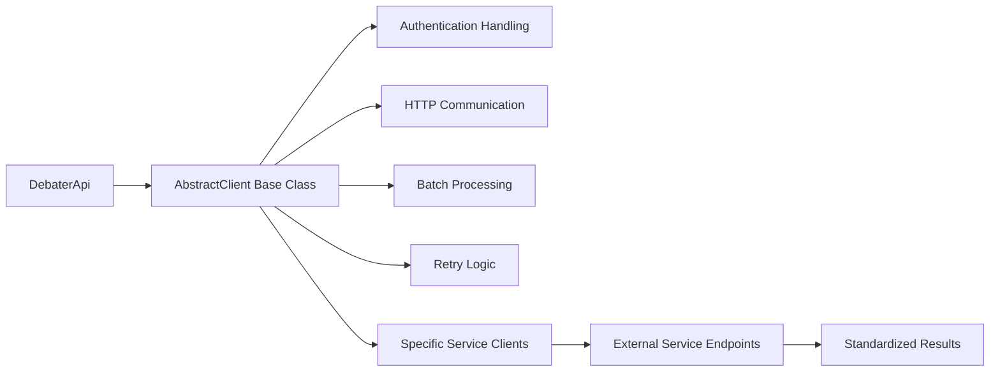

<!-- Source: debater-early-access-program-sdk-Deepwiki.md -->
<!-- Section: Available Services Overview -->
<!-- Lines: 415-464 -->

## Available Services Overview

The SDK provides access to multiple NLP services through specialized client classes:

| Service | Client Method | Purpose |
|---------|---------------|---------|
| Key Point Analysis | `get_keypoints_client()` | Identify and match key points in text collections |
| Argument Quality | `get_argument_quality_client()` | Score argument quality for sentence-topic pairs |
| Claim Detection | `get_claim_detection_client()` | Detect claims in text relative to topics |
| Evidence Detection | `get_evidence_detection_client()` | Identify evidence in text for topics |
| Clustering | `get_clustering_client()` | Group similar sentences into clusters |
| Claim Boundaries | `get_claim_boundaries_client()` | Identify claim boundaries within sentences |
| Pro/Con Analysis | `get_pro_con_client()` | Determine pro/con stance relative to topics |
| Term Relations | `get_term_relater_client()` | Measure semantic relatedness between terms |

### Service Usage Pattern

All service clients follow a consistent usage pattern:

```python
# Get specific client
service_client = debater_api.get_[service_name]_client()

# Prepare input data (varies by service)
input_data = [{'sentence': 'text', 'topic': 'topic'}]  # Common format

# Run analysis
results = service_client.run(input_data)

# Process results (format varies by service)
```

**Service Client Pattern**



Sources: [debater_python_api/integration_tests/api/clients/ServicesIT.py:28-173]()

