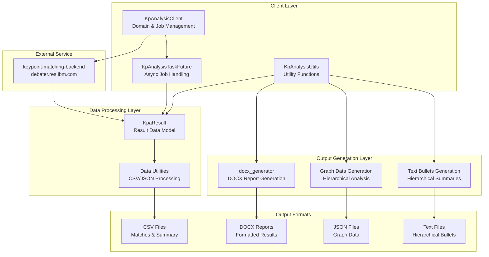
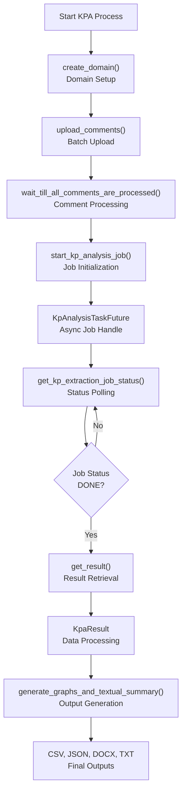

<!-- Source: debater-early-access-program-sdk-Deepwiki.md -->
<!-- Section: System Overview -->
<!-- Lines: 522-596 -->

## System Overview

The Key Point Analysis system operates through a multi-stage pipeline that processes textual comments, extracts key points, matches sentences to these key points, and generates various output formats including reports, visualizations, and hierarchical summaries.

### Core Architecture

Sources: [debater_python_api/api/clients/keypoints_client.py:23-344](), [debater_python_api/api/clients/key_point_analysis/KpAnalysisUtils.py:13-512]()

### Key Point Analysis Workflow

Sources: [debater_python_api/api/clients/keypoints_client.py:88-263](), [debater_python_api/api/clients/keypoints_client.py:345-412]()

