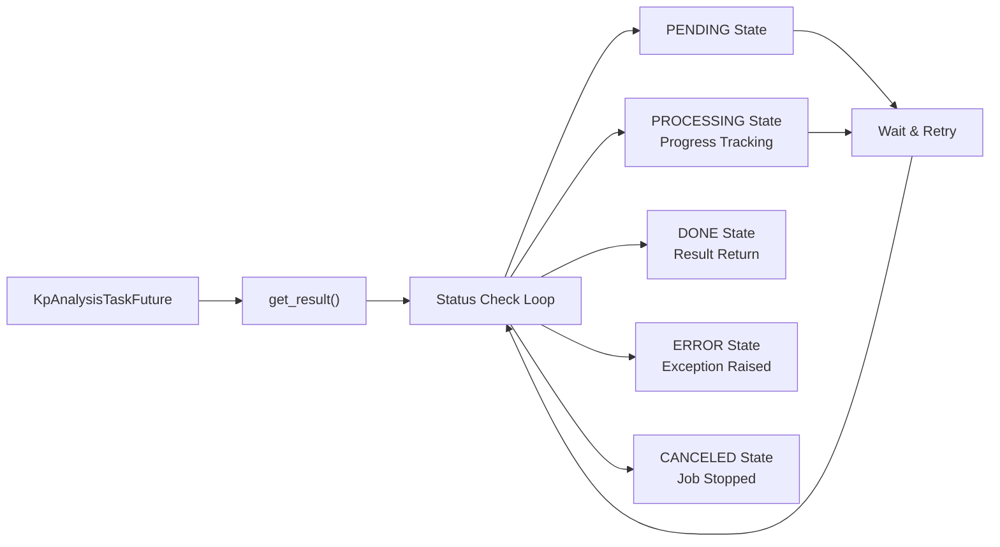

<!-- Source: debater-early-access-program-sdk-Deepwiki.md -->
<!-- Section: Core Components -->
<!-- Lines: 597-666 -->

## Core Components

### KpAnalysisClient

The `KpAnalysisClient` class serves as the primary interface for interacting with the Key Point Analysis service. It provides methods for domain management, comment upload, job execution, and result retrieval.

| Method | Purpose | Key Parameters |
|--------|---------|----------------|
| `create_domain()` | Creates analysis domains with custom parameters | `domain`, `domain_params` |
| `upload_comments()` | Uploads comments for analysis in batches | `domain`, `comments_ids`, `comments_texts` |
| `start_kp_analysis_job()` | Initiates KPA job asynchronously | `domain`, `run_params`, `comments_ids` |
| `get_kp_extraction_job_status()` | Polls job status and retrieves results | `job_id`, `top_k_kps` |
| `run()` | Simplified end-to-end analysis for small datasets | `comments_texts`, `comments_ids` |

**Domain Parameters:**
- `dont_split`: Prevents automatic sentence splitting
- `do_stance_analysis`: Enables stance detection (positive/negative/neutral)
- `do_kp_quality`: Calculates keypoint quality scores

**Run Parameters:**
- `keypoints`: Predefined keypoints for matching
- `arg_min_len`/`arg_max_len`: Sentence length filtering
- `mapping_policy`: Matching strictness (STRICT/NORMAL/LOOSE)
- `n_top_kps`: Number of keypoints to generate

Sources: [debater_python_api/api/clients/keypoints_client.py:23-344]()

### KpAnalysisTaskFuture

The `KpAnalysisTaskFuture` class handles asynchronous job execution, providing polling capabilities and result retrieval for long-running KPA jobs.

Sources: [debater_python_api/api/clients/keypoints_client.py:345-428]()

### KpAnalysisUtils

The `KpAnalysisUtils` class provides static utility methods for result processing, report generation, and data transformation.

**Key Utility Functions:**

| Method | Purpose | Output |
|--------|---------|---------|
| `write_result_to_csv()` | Exports results to CSV format | Matches and summary files |
| `create_graph_data()` | Generates graph data for visualization | JSON graph structure |
| `generate_graphs_and_textual_summary()` | Creates comprehensive output package | Multiple file formats |
| `hierarchical_graph_data_to_textual_bullets()` | Converts graph to hierarchical text | Bullet-point summaries |

**Graph Data Generation Process:**
1. Extract keypoint-to-sentence mappings
2. Calculate inter-keypoint relationships
3. Create nodes (keypoints) and edges (relationships)
4. Generate hierarchical structure
5. Filter based on relationship thresholds

Sources: [debater_python_api/api/clients/key_point_analysis/KpAnalysisUtils.py:52-512]()

