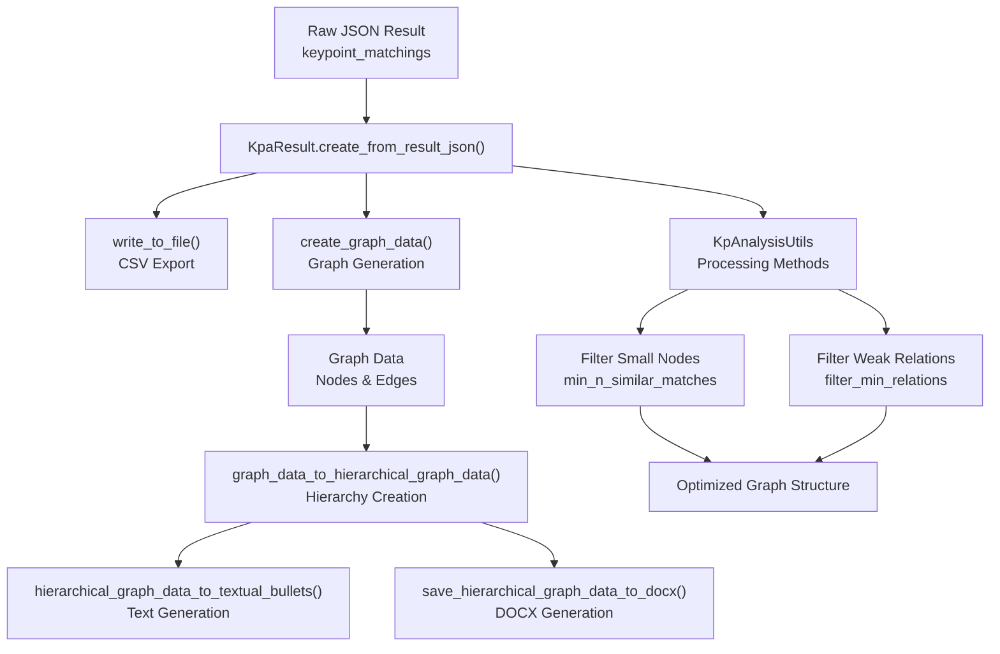

<!-- Source: debater-early-access-program-sdk-Deepwiki.md -->
<!-- Section: Data Processing Pipeline -->
<!-- Lines: 667-723 -->

## Data Processing Pipeline

### Result Processing Flow



Sources: [debater_python_api/api/clients/key_point_analysis/KpAnalysisUtils.py:137-210](), [debater_python_api/api/clients/key_point_analysis/KpAnalysisUtils.py:313-377]()

### Output Generation Methods

The system generates multiple output formats to support different analysis needs:

**CSV Files:**
- `*_result.csv`: Complete sentence-to-keypoint matches
- `*_kps_summary.csv`: Aggregated keypoint statistics
- `*_hierarchy.csv`: Hierarchical relationship data

**JSON Files:**
- `*_graph_data.json`: Full graph structure for visualization
- `*_hierarchical_graph_data.json`: Simplified hierarchical graph

**Document Files:**
- `*_hierarchical.docx`: Formatted Microsoft Word report
- `*_hierarchical_bullets.txt`: Plain text hierarchical summary

**Graph Data Structure:**
```json
{
  "type": "node",
  "data": {
    "id": "node_id",
    "kp": "keypoint_text",
    "n_matches": "match_count",
    "relative_val": "normalized_score",
    "matches": [{"sentence_text": "...", "match_score": 0.85}]
  }
}
```

Sources: [debater_python_api/api/clients/key_point_analysis/KpAnalysisUtils.py:144-209](), [debater_python_api/api/clients/key_point_analysis/KpAnalysisUtils.py:313-377]()

