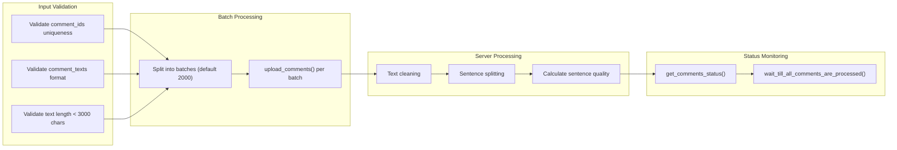

<!-- Source: debater-early-access-program-sdk-Deepwiki.md -->
<!-- Section: Comment Upload and Processing -->
<!-- Lines: 904-980 -->

## Comment Upload and Processing

Comments must be uploaded to domains before running KPA jobs. The system processes comments by cleaning text and splitting into sentences.

### Upload Process



### Upload Comments

```python
# Upload comments to domain
comments_ids = ['1', '2', '3']
comments_texts = [
    'Cannabis has detrimental effects on cognition',
    'Cannabis can severely impact memory',
    'Cannabis harms learning capabilities'
]

kpa_client.upload_comments('my_domain', comments_ids, comments_texts)

# Monitor processing status
status = kpa_client.get_comments_status('my_domain')
print(f"Processed: {status['processed_comments']}")
print(f"Pending: {status['pending_comments']}")
print(f"Sentences: {status['processed_sentences']}")

# Wait for all comments to be processed
kpa_client.wait_till_all_comments_are_processed('my_domain')
```

### Comment Upload Constraints

| Constraint | Value | Description |
|------------|-------|-------------|
| Max comment length | 3000 characters | Individual comment text limit |
| Batch size | 2000 (default) | Comments per API call |
| Comment ID uniqueness | Required | No duplicate IDs within domain |
| Empty comments | Not allowed | Comments must contain non-whitespace text |

Sources: [debater_python_api/api/clients/keypoints_client.py:109-143](), [debater_python_api/api/clients/keypoints_client.py:144-166]()

