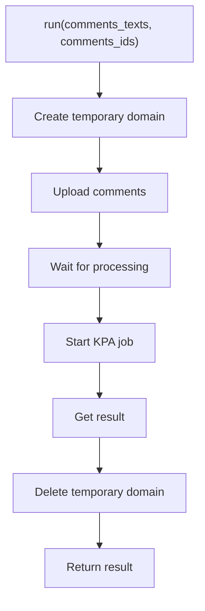

<!-- Source: debater-early-access-program-sdk-Deepwiki.md -->
<!-- Section: Simple Usage Pattern -->
<!-- Lines: 1133-1177 -->

## Simple Usage Pattern

For straightforward use cases, the `run` method provides a simplified interface that handles the entire workflow.

```python
# Simple usage - handles everything automatically
comments_texts = [
    'Cannabis has detrimental effects on cognition',
    'Cannabis can severely impact memory',
    'Cannabis harms learning capabilities'
]

result = kpa_client.run(comments_texts)

# With custom comment IDs
comments_ids = ['comment_1', 'comment_2', 'comment_3']
result = kpa_client.run(comments_texts, comments_ids)
```

### Simple Usage Workflow



**Limitations**: The `run` method is limited to 10,000 comments maximum.

Sources: [debater_python_api/api/clients/keypoints_client.py:239-263](), [debater_python_api/examples/keypoints_example.py:1-23]()

