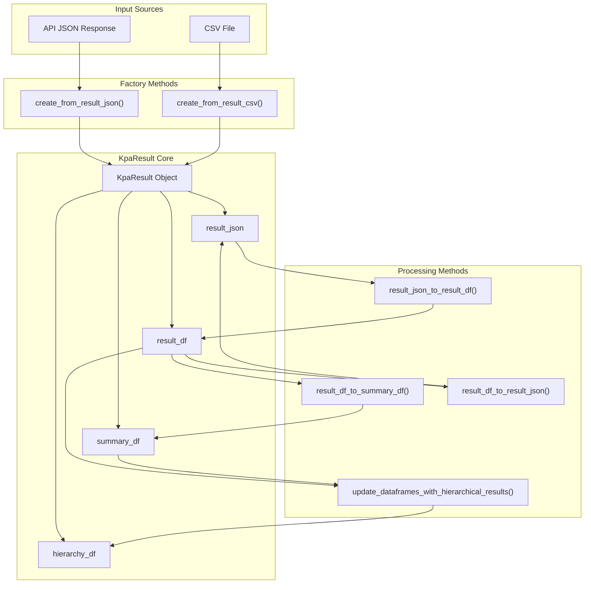

<!-- Source: debater-early-access-program-sdk-Deepwiki.md -->
<!-- Section: KpaResult Data Model -->
<!-- Lines: 1245-1307 -->

## KpaResult Data Model

The `KpaResult` class contains four primary data structures that represent different views of the analysis results:

| Component | Type | Purpose |
|-----------|------|---------|
| `result_json` | dict | Raw JSON response from the API |
| `result_df` | DataFrame | Detailed match-level results |
| `summary_df` | DataFrame | Key point summary statistics |
| `hierarchy_df` | DataFrame | Hierarchical relationship data |

**KpaResult Data Flow**

Sources: [debater_python_api/api/clients/key_point_analysis/KpaResult.py:13-19]()

