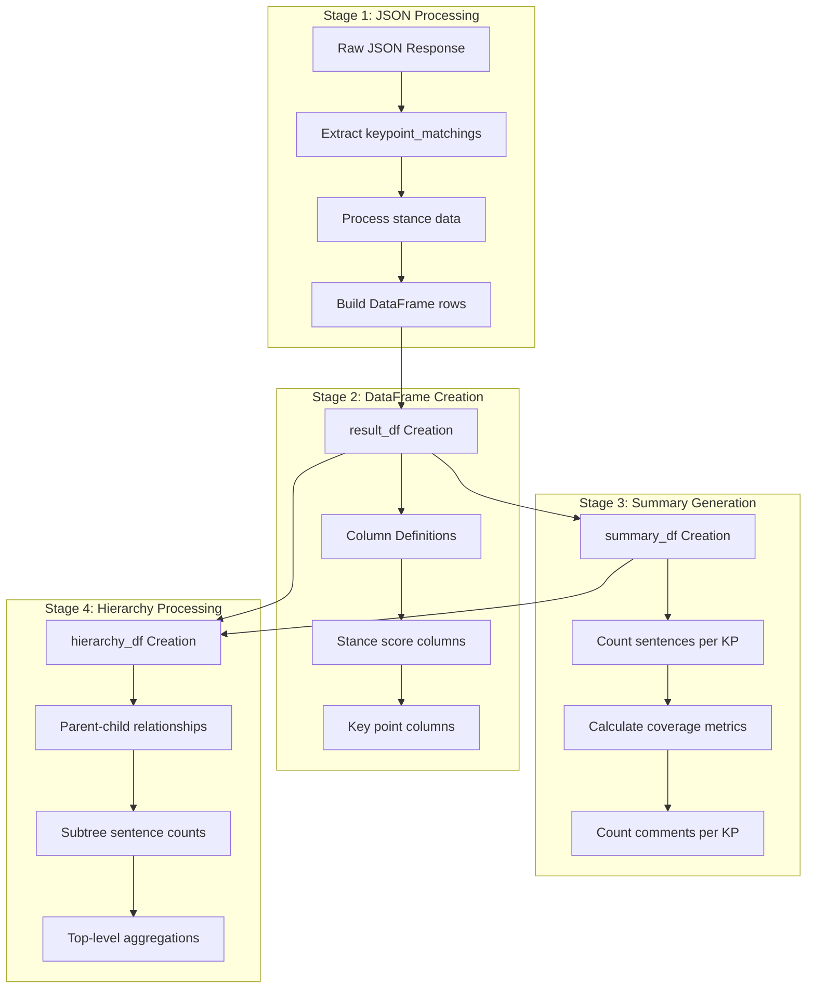

<!-- Source: debater-early-access-program-sdk-Deepwiki.md -->
<!-- Section: Data Transformation Pipeline -->
<!-- Lines: 1308-1403 -->

## Data Transformation Pipeline

The system transforms raw API responses through a multi-stage pipeline that creates different analytical views of the data.

**Data Processing Pipeline**

Sources: [debater_python_api/api/clients/key_point_analysis/KpaResult.py:22-61](), [debater_python_api/api/clients/key_point_analysis/KpaResult.py:64-114](), [debater_python_api/api/clients/key_point_analysis/KpaResult.py:117-141]()

### Result DataFrame Structure

The `result_df` contains detailed match-level information with the following core columns:

| Column | Description |
|--------|-------------|
| `kp` | Key point text |
| `sentence_text` | Matched sentence text |
| `match_score` | Match confidence score |
| `comment_id` | Source comment identifier |
| `sentence_id` | Sentence identifier within comment |
| `argument_quality` | Argument quality score |
| `kp_quality` | Key point quality score |

Additional columns are dynamically added based on the analysis configuration:
- Stance score columns (when stance analysis is enabled)
- `selected_stance` and `stance_conf` for the highest-confidence stance
- `kp_stance` for key point stance assignment

Sources: [debater_python_api/api/clients/key_point_analysis/KpaResult.py:55-61]()

### Summary DataFrame Structure

The `summary_df` provides aggregated statistics for each key point:

| Column | Description |
|--------|-------------|
| `kp` | Key point text |
| `#sentences` | Number of matched sentences |
| `sentences_coverage` | Percentage of total sentences |
| `#comments` | Number of comments containing matches |
| `comments_coverage` | Percentage of total comments |
| `num_tokens` | Token count for the key point |
| `argument_quality` | Argument quality score |
| `kp_quality` | Key point quality score |

Sources: [debater_python_api/api/clients/key_point_analysis/KpaResult.py:110-114]()

