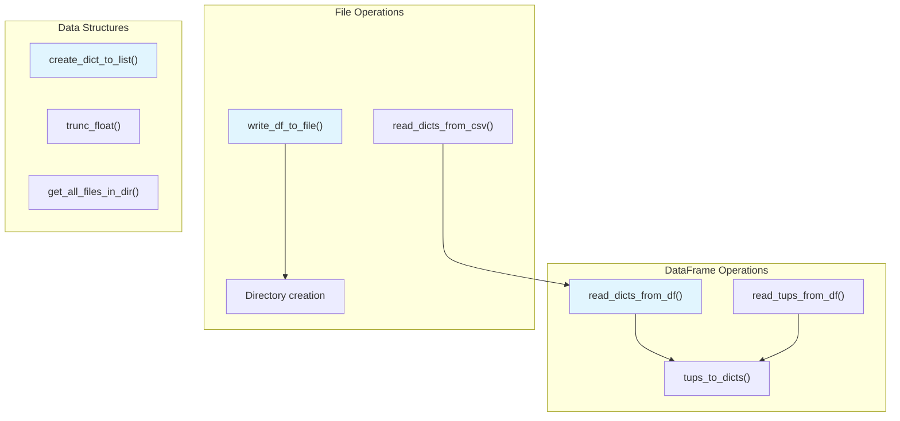

<!-- Source: debater-early-access-program-sdk-Deepwiki.md -->
<!-- Section: Utility Functions -->
<!-- Lines: 1481-1544 -->

## Utility Functions

The system includes utility functions for data processing operations:

**Data Processing Utilities**

Sources: [debater_python_api/api/clients/key_point_analysis/utils.py:9-65]()

### Key Utility Functions

| Function | Purpose |
|----------|---------|
| `read_dicts_from_df()` | Convert DataFrame to list of dictionaries |
| `create_dict_to_list()` | Group list of tuples into dictionary |
| `write_df_to_file()` | Export DataFrame to CSV with directory creation |
| `trunc_float()` | Truncate floating-point numbers to specified precision |

Sources: [debater_python_api/api/clients/key_point_analysis/utils.py:35-37](), [debater_python_api/api/clients/key_point_analysis/utils.py:9-13](), [debater_python_api/api/clients/key_point_analysis/utils.py:58-64](), [debater_python_api/api/clients/key_point_analysis/utils.py:43-51]()19:T2c61,# Reporting and Visualization

Relevant source files

The following files were used as context for generating this wiki page:

- [debater_python_api/api/clients/key_point_analysis/KpAnalysisUtils.py](debater_python_api/api/clients/key_point_analysis/KpAnalysisUtils.py)
- [debater_python_api/api/clients/key_point_analysis/docx_generator.py](debater_python_api/api/clients/key_point_analysis/docx_generator.py)

This page covers the reporting and visualization capabilities of the Key Point Analysis system, including console output, file generation, graph creation, and document formatting. The system provides multiple output formats from KPA results including CSV files, JSON graph data, hierarchical text representations, and formatted DOCX reports.

For information about processing KPA results and the `KpaResult` data model, see [Data Processing and Results](#3.2). For general SDK utilities beyond KPA-specific reporting, see [Utilities and Helpers](#5.3).

