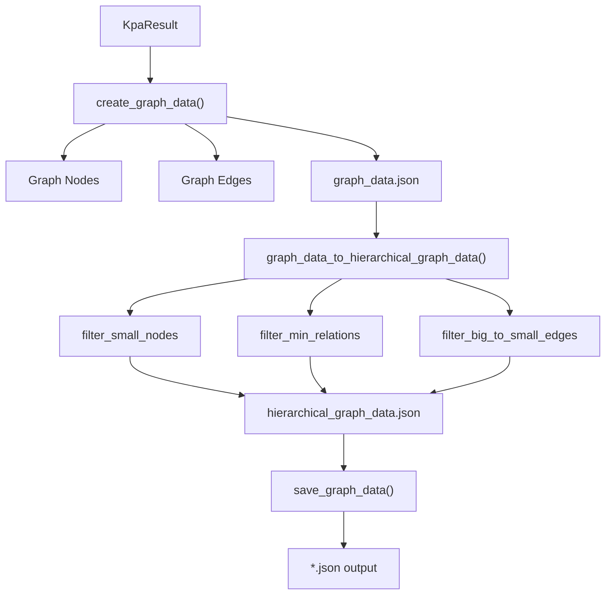

<!-- Source: debater-early-access-program-sdk-Deepwiki.md -->
<!-- Section: Graph Data and Visualization -->
<!-- Lines: 1620-1679 -->

## Graph Data and Visualization

The system creates interactive graph representations of key point relationships that can be used with visualization tools.

### Graph Data Creation

The `create_graph_data()` method transforms KPA results into graph format:

```python
graph_data = KpAnalysisUtils.create_graph_data(
    kpa_result, 
    min_n_similar_matches=5, 
    n_matches_samples=20
)
```

This creates nodes representing key points and edges representing relationships based on shared matching sentences. The algorithm:
1. Creates nodes for each key point with match statistics
2. Calculates edge weights based on sentence overlap between key points
3. Includes sample matching sentences for each key point

### Hierarchical Graph Generation

The `graph_data_to_hierarchical_graph_data()` method simplifies graphs into hierarchical structures:

```python
hierarchical_data = KpAnalysisUtils.graph_data_to_hierarchical_graph_data(
    graph_data=graph_data,
    filter_small_nodes=0.1,
    filter_min_relations=0.4,
    filter_big_to_small_edges=True
)
```

This applies filtering to create cleaner hierarchical representations by removing small nodes, weak relationships, and maintaining parent-child directionality.



**Graph Data Processing Pipeline**

**Sources:** [debater_python_api/api/clients/key_point_analysis/KpAnalysisUtils.py:137-209](), [debater_python_api/api/clients/key_point_analysis/KpAnalysisUtils.py:214-256]()

