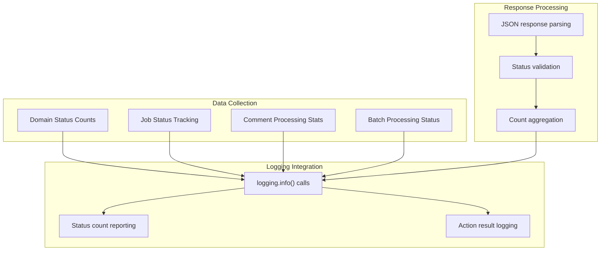

<!-- Source: debater-early-access-program-sdk-Deepwiki.md -->
<!-- Section: System Monitoring -->
<!-- Lines: 1992-2052 -->

## System Monitoring

The admin client provides comprehensive system monitoring through logging and status reporting mechanisms.

### Monitoring Capabilities

All admin operations include built-in logging through Python's `logging` module, providing detailed information about operation results, entity counts, and system state changes.

**Sources:** [debater_python_api/api/clients/keypoints_admin_client.py:21-131]()1b:T30a6,# Other NLP Services

Relevant source files

The following files were used as context for generating this wiki page:

- [debater_python_api/api/clients/argument_quality_client.py](debater_python_api/api/clients/argument_quality_client.py)
- [debater_python_api/examples/keypoints_example.py](debater_python_api/examples/keypoints_example.py)
- [debater_python_api/integration_tests/api/clients/ServicesIT.py](debater_python_api/integration_tests/api/clients/ServicesIT.py)

This document covers the additional NLP service clients available in the Debater Python SDK beyond Key Point Analysis. These services provide specialized natural language processing capabilities including argument quality scoring, claim detection, evidence detection, text clustering, and more.

For comprehensive information about Key Point Analysis, the primary feature of the SDK, see [Key Point Analysis](#3).

