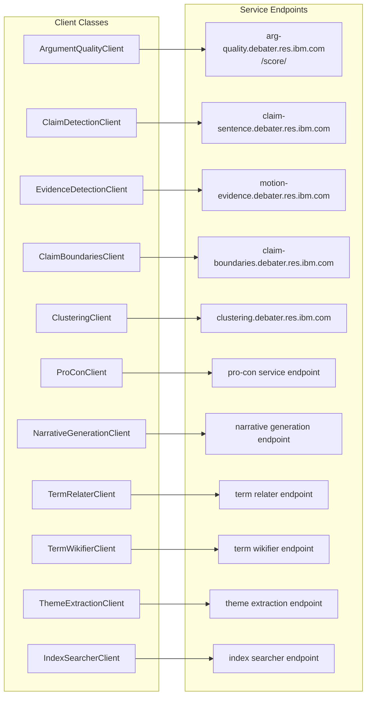

<!-- Source: debater-early-access-program-sdk-Deepwiki.md -->
<!-- Section: Service Endpoint Mapping -->
<!-- Lines: 2134-2182 -->

## Service Endpoint Mapping

The following diagram shows the mapping between client classes and their corresponding service endpoints:

Sources: [debater_python_api/api/clients/argument_quality_client.py:6-11](), [debater_python_api/integration_tests/api/clients/ServicesIT.py:28-238]()

