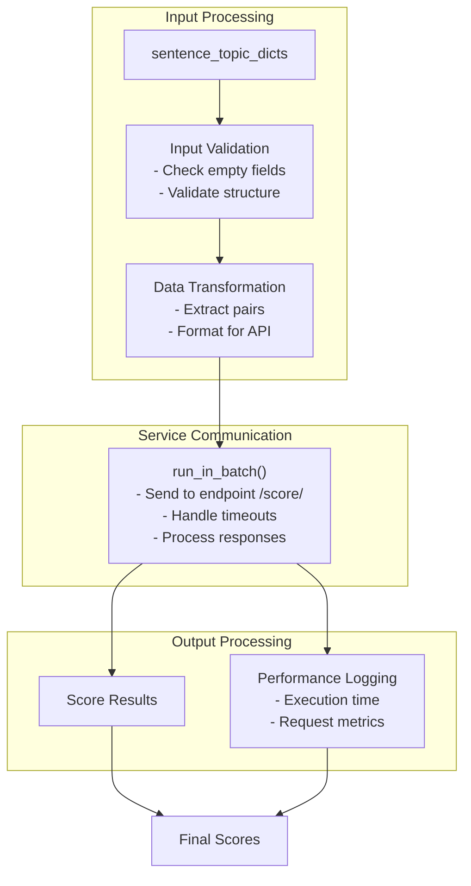

<!-- Source: debater-early-access-program-sdk-Deepwiki.md -->
<!-- Section: Processing Pipeline -->
<!-- Lines: 2682-2714 -->

## Processing Pipeline

The processing pipeline transforms input data and manages communication with external services:

**Sources:** [debater_python_api/api/clients/claim_and_evidence_detection_client.py:13-24]()

