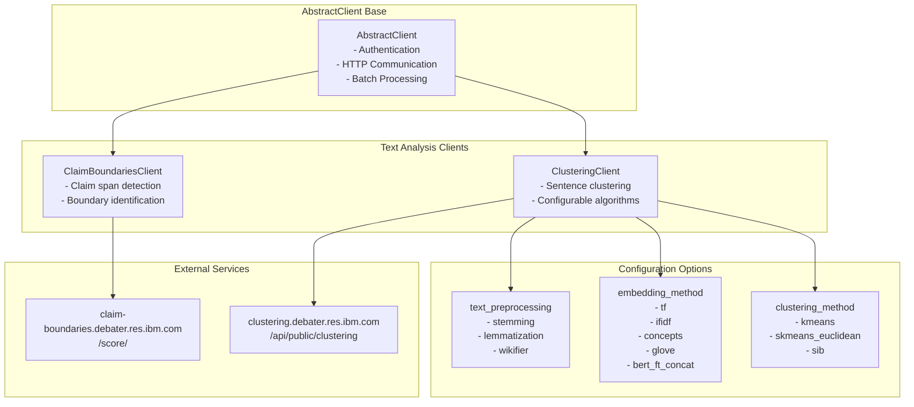

<!-- Source: debater-early-access-program-sdk-Deepwiki.md -->
<!-- Section: Overview -->
<!-- Lines: 2753-2793 -->

## Overview

The text analysis clients provide specialized natural language processing capabilities that extend beyond the core debating services. These clients follow the same architectural patterns as other SDK clients, inheriting from `AbstractClient` and providing standardized interfaces for their respective services.

### Text Analysis Client Architecture

**Sources:** [debater_python_api/api/clients/claim_boundaries_client.py:1-22](), [debater_python_api/api/clients/clustering_client.py:1-113]()

