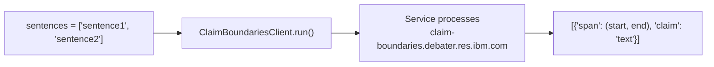

<!-- Source: debater-early-access-program-sdk-Deepwiki.md -->
<!-- Section: ClaimBoundariesClient -->
<!-- Lines: 2794-2827 -->

## ClaimBoundariesClient

The `ClaimBoundariesClient` identifies claim boundaries within sentences, determining the specific spans of text that constitute claims.

### Functionality

| Method | Purpose | Input | Output |
|--------|---------|-------|--------|
| `run(sentences)` | Detect claim boundaries | List of sentences | List of span dictionaries |

The client processes sentences and returns boundary information including:
- **span**: Tuple indicating start and end positions of the claim
- **claim**: Extracted claim text

### Usage Pattern

### Implementation Details

The client uses a timeout of 100 seconds for batch processing and includes performance logging. The service endpoint is `/score/` and processes sentences through the inherited `run_in_batch` method from `AbstractClient`.

**Sources:** [debater_python_api/api/clients/claim_boundaries_client.py:9-22]()

