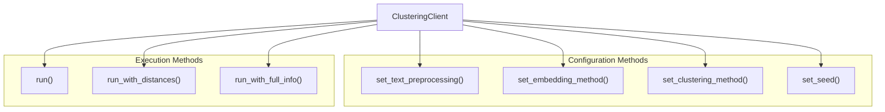

<!-- Source: debater-early-access-program-sdk-Deepwiki.md -->
<!-- Section: ClusteringClient -->
<!-- Lines: 2828-2897 -->

## ClusteringClient

The `ClusteringClient` groups sentences into semantic clusters using configurable preprocessing, embedding, and clustering algorithms.

### Configuration Options

The client provides extensive configuration through three main categories:

| Category | Options | Default | Description |
|----------|---------|---------|-------------|
| Text Preprocessing | `stemming`, `lemmatization`, `wikifier`, `stemming_over_lemmatization` | `stemming` | Text normalization approach |
| Embedding Method | `tf`, `ifidf`, `concepts`, `glove`, `bert_ft_concat` | `tf` | Vector representation method |
| Clustering Method | `kmeans`, `skmeans_euclidean`, `sib` | `sib` | Clustering algorithm |

### Methods

| Method | Purpose | Returns | Additional Information |
|--------|---------|---------|----------------------|
| `run(sentences, num_of_clusters)` | Basic clustering | List of sentence clusters | Sentences grouped by similarity |
| `run_with_distances(sentences, num_of_clusters)` | Clustering with distances | List of [sentence, distance] pairs | Includes distance from cluster center |
| `run_with_full_info(sentences, num_of_clusters)` | Complete clustering info | List of detailed cluster objects | Includes text, id, and distance |

### Configuration Methods

### Processing Flow

The clustering process includes several validation and processing steps:

1. **Configuration validation**: Ensures compatible algorithm combinations
2. **Input validation**: Checks for empty inputs and validates cluster count
3. **Text preprocessing**: Applies selected preprocessing methods
4. **Sentence sorting**: Sorts sentences for consistent service interaction
5. **Index translation**: Maps results back to original sentence order

### Error Handling

The client includes specific error handling for:
- Invalid configurations (e.g., `sib` clustering requires `tf` embedding)
- Empty sentence lists
- Insufficient sentences for requested cluster count

**Sources:** [debater_python_api/api/clients/clustering_client.py:9-113]()

