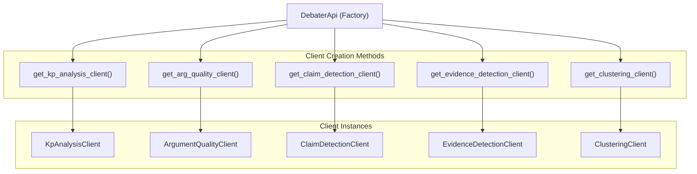
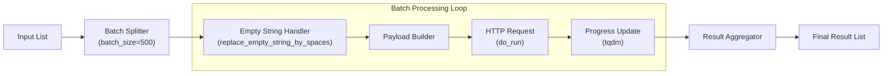

<!-- Source: debater-early-access-program-sdk-Deepwiki.md -->
<!-- Section: SDK Architecture Overview -->
<!-- Lines: 2955-3085 -->

## SDK Architecture Overview

The Debater Python API SDK follows a layered architecture with consistent design patterns across all service clients. The core design is built around inheritance from `AbstractClient`, providing common functionality while allowing specialized implementations for each service.

### Client Factory Pattern

The SDK uses a factory pattern through the `DebaterApi` class to provide a unified entry point for all service clients:

### AbstractClient Base Class

All service clients inherit from `AbstractClient`, which provides common functionality for HTTP communication, batch processing, and error handling:

```mermaid
graph TD
    AbstractClient["AbstractClient"]
    
    subgraph "Core Methods"
        init["__init__(apikey)"]
        set_host["set_host(host)"]
        set_show_process["set_show_process(show_process)"]
        do_run["do_run(payload, endpoint, ...)"]
        run_in_batch["run_in_batch(list_name, list, ...)"]
        get_status_error_msg["get_status_error_msg(response)"]
    end
    
    subgraph "Specialized Clients"
        KpAnalysisClient["KpAnalysisClient"]
        KpAnalysisAdminClient["KpAnalysisAdminClient"]
        ArgumentQualityClient["ArgumentQualityClient"]
        ClaimDetectionClient["ClaimDetectionClient"]
        EvidenceDetectionClient["EvidenceDetectionClient"]
        ClusteringClient["ClusteringClient"]
        ClaimBoundariesClient["ClaimBoundariesClient"]
    end
    
    AbstractClient --> init
    AbstractClient --> set_host
    AbstractClient --> set_show_process
    AbstractClient --> do_run
    AbstractClient --> run_in_batch
    AbstractClient --> get_status_error_msg
    
    AbstractClient --> KpAnalysisClient
    AbstractClient --> KpAnalysisAdminClient
    AbstractClient --> ArgumentQualityClient
    AbstractClient --> ClaimDetectionClient
    AbstractClient --> EvidenceDetectionClient
    AbstractClient --> ClusteringClient
    AbstractClient --> ClaimBoundariesClient
```

**Sources:** [debater_python_api/api/clients/abstract_client.py:19-118]()

### Common Client Functionality

The `AbstractClient` provides several key features used across all service clients:

| Feature | Method | Purpose |
|---------|---------|---------|
| **API Key Validation** | `__init__(apikey)` | Validates API key on client initialization |
| **Host Configuration** | `set_host(host)` | Sets the service endpoint URL |
| **Batch Processing** | `run_in_batch()` | Processes large datasets in configurable batches |
| **Progress Tracking** | `set_show_process()` | Controls progress bar display for long operations |
| **HTTP Communication** | `do_run()` | Handles HTTP POST requests with retries and error handling |
| **Error Parsing** | `get_status_error_msg()` | Extracts error information from HTTP responses |

**Sources:** [debater_python_api/api/clients/abstract_client.py:20-106]()

### Batch Processing Implementation

The SDK includes built-in support for processing large datasets through the `run_in_batch()` method:

**Sources:** [debater_python_api/api/clients/abstract_client.py:37-53]()

